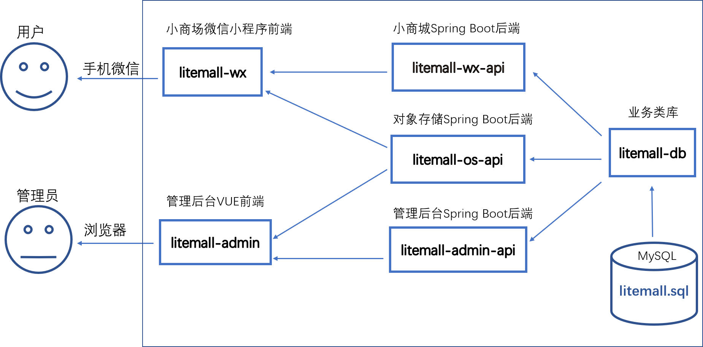
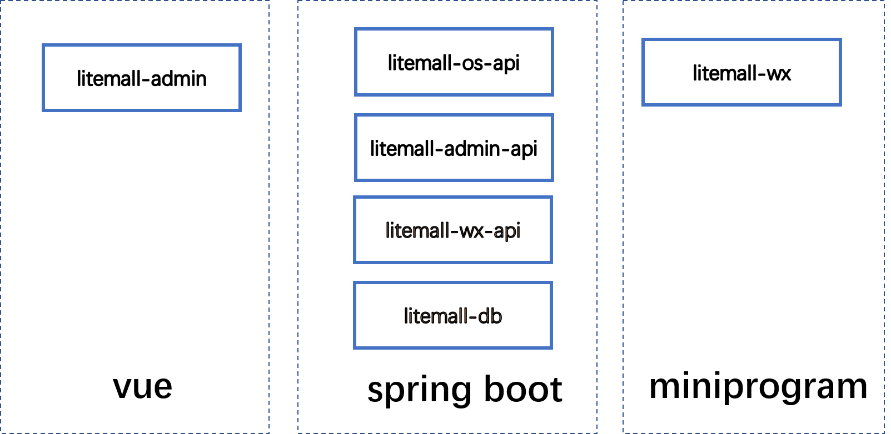
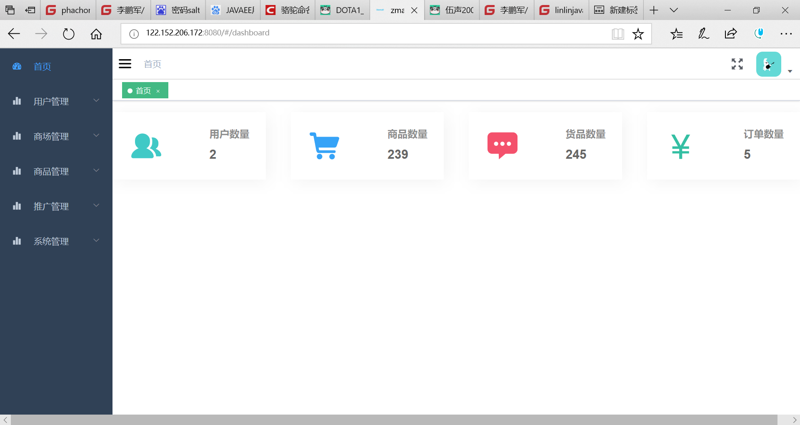
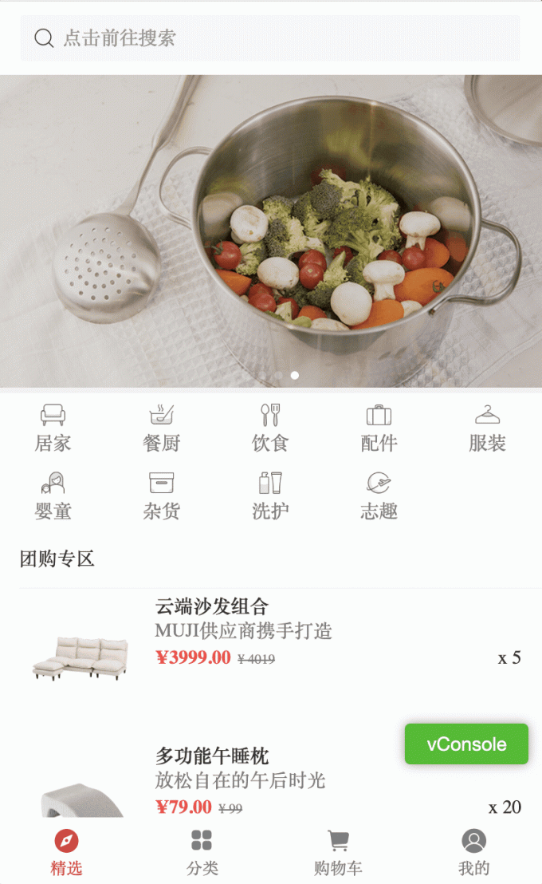

litemall
=====

又一个小商场系统。

项目代码
====

* [码云](https://gitee.com/linlinjava/litemall)
* [GitHub](https://github.com/linlinjava/litemall)

项目架构
====
    

技术栈
===

> 1. Spring Boot
> 2. Vue
> 3. 微信小程序

    

效果
==

### 小商城效果

    

* 首页
* 专题列表、专题详情
* 分类列表、分类详情
* 品牌列表、品牌详情
* 新品首发
* 人气推荐
* 商品搜索
* 商品详情
* 商品评价列表、商品评价
* 购物车
* 下单
* 我的主页
* 订单列表、订单详情
* 地址列表、地址添加、地址删除
* 我的收藏
* 我的足迹

### 管理平台效果

    

* 会员管理
  * 会员管理
  * 收货地址管理
  * 会员收藏
  * 会员足迹
  * 搜索历史
  * 购物车
* 商城管理
  * 区域配置
  * 品牌制造商
  * 订单管理
  * 商品类目
  * 通用问题
  * 关键词
* 商品管理
  * 商品管理
  * 商品参数
  * 商品规格
  * 货品管理
  * 用户评论
* 推广管理
  * 广告列表
  * 专题管理
* 系统管理
  * 管理员
  * 对象存储

云演示
==

### 小商城演示访问

由于没有上线，只能在微信开发工具中测试运行：

1. 微信开发工具导入litemall-wx项目;
2. 项目配置，启用“不校验合法域名、web-view（业务域名）、TLS 版本以及 HTTPS 证书”
3. 点击“编译”，即可在微信开发工具预览效果；
4. 也可以点击“预览”，然后手机扫描登录。

    

### 管理平台演示访问

1. 浏览器打开，输入以下网址[http://122.152.206.172:8080/#/login](http://122.152.206.172:8080/#/login)
2. 用户名`admin123`，密码`admin123`

文档
==

1. [系统架构](doc/1.md)
2. [基础子系统](doc/2.md)
3. [小商场子系统](doc/3.md)
4. [管理后台子系统](doc/4.md)
5. [商场子系统](doc/5.md)
6. [下一步计划](doc/6.md)

开发计划
====

目前项目开发中，存在诸多不足，以下是目前规划的开发计划。

V 1.0.0 完成以下目标：
1. 除了部分功能（如支付和优惠券等），小商城的优化和改进基本结束；
2. 管理后台基本实现所有表的CRUD操作；
3. 后台服务能够对参数进行检验。

V 2.0.0 完成以下目标：
1. 小商城能够完成基本的业务功能；
2. 管理后台实现较好的业务操作和交互效果，而不是简单的CRUD；
3. 管理后台实现统计功能、日志功能

V 3.0.0 完成以下目标：
1. 管理后台一些辅助功能
2. 后台服务加强安全功能、事务功能
3. 项目代码重构和清理
4. 其他配套服务，如代码文档、war部署支持

项目结束，已经是一个真正可工作的项目，此时进入维护阶段。

如果真的坚持到维护阶段，那么存在三种可能性：
1. 或者开发 V 4.0.0，实现web商场子系统；
2. 或者重新开发一个新的独立项目，引入企业级功能，如缓存、权限、对象存储云服务等；
3. 或者结束，不再开发，仅仅维护。

警告：
> ** 以上仅仅是个人规划的开发计划，实际可能出现任何情况，例如能力有限而放弃开发。**

开发进度更新
==

* V 0.1.0，项目架构基本完成。
* V 0.2.0，修复一些小商场出现的问题。
  * `小商场`微信登录
  * `小商场`账号登录、注册、找回密码
  （注意手机验证码不支持，因此目前只是完成基本功能，但是存在安全风险）
  * `小商场`订单编号采用日期+6位随机数
  * `小商场`简单运费计算
  * `小商场`专题评价
  * `管理后台`禁止用户修改超级管理员信息
  * `部署`自动脚本util/lazy.sh和util/upload.sh
* V 0.3.0,
  * `小商场`的后台服务加密用户账号密码
  * `小商场`如果用户选择货品，则显示货品对应的价格；否则显示商品价格
  * `小商场`只有规格都选择，则商品页面才显示所对应货品的规格文本
  * `管理后台`商品详细信息支持tinymce富文本编辑
  * `管理后台`的后台服务加密管理员密码
  * `管理后台`完善登录退出逻辑
  * `数据库`除regions几个表，其他所有表都添加`add_time`和`deleted`字段
  * `业务访问模块`不支持数据物理删除，删除则设置`deleted`，而查询则过滤`deleted`
  
警告
==

> 1. 本项目仅用于学习练习
> 2. 数据库数据来自nideshop
> 3. 项目代码目前还不完善，仍处在开发中
> 4. 项目开源（MIT），但不承担任何使用后果

致谢
==

本项目基于或参考以下项目：
> 1. [nideshop-mini-program](https://github.com/tumobi/nideshop-mini-program)
> 如果后端希望采用nodejs，用户可以访问nideshop项目
> 2. [platform](https://gitee.com/fuyang_lipengjun/platform)
> 如果后端希望采用非spring boot版的普通spring版或者更多功能，
> 用户可以访问platform项目
> 3. [vue-element-admin](https://github.com/PanJiaChen/vue-element-admin)
> 一个基于Vue和Element的后台集成方案

本项目所依赖的其他开源项目见相关章节

问题
==

用户有问题或者好的建议可以用Issues反馈交流，请给出详细信息，本人会尽可能解决。
 * 如果问题是共性问题（如代码bug或文档不全），本人会及时解决。
 * 如果问题是个人问题（如用户了解不深入或者没有相关技术），请见谅（本人也是百度和谷歌）。
 
贡献
==

任何形式的贡献都欢迎，包括：

* Issue里面报告的BUG
* Issue里面对业务或技术的讨论
* Pull Request
* 对文档的意见或补充
* 其他任何有意义本项目的行为

个人能力有限，欢迎一起开发。

目前litemall开发交流群：

注意:
> * 这是开发交流群。
> * 如果用户开发使用中有问题，建议采用Issue来报告问题和解决问题。
> * 在开发交流群中应讨论开发、业务和合作问题。
> * 交流结果如果是共识性的则在文档中记录，如果是开放性的则会在Issue中记录。