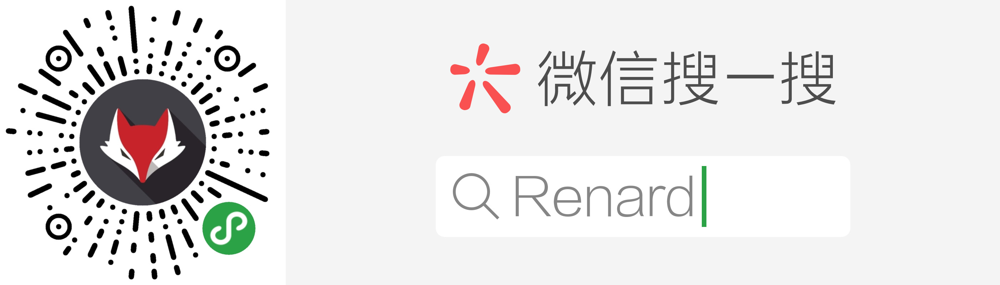

# litemall

又一个小商场系统。

litemall = Spring Boot后端 + Vue管理员前端 + 微信小程序用户前端

* [文档](https://linlinjava.gitbook.io/litemall)
* [贡献](https://linlinjava.gitbook.io/litemall/contribute)
* [FAQ](https://linlinjava.gitbook.io/litemall/7)

## 上架实例

    

## 项目代码

* [码云](https://gitee.com/linlinjava/litemall)
* [GitHub](https://github.com/linlinjava/litemall)

## 项目架构
    

## 技术栈

> 1. Spring Boot
> 2. Vue
> 3. 微信小程序

    

## 功能

### 小商城功能

* 首页
* 专题列表、专题详情
* 分类列表、分类详情
* 品牌列表、品牌详情
* 新品首发、人气推荐
* 搜索
* 商品详情
* 商品评价列表、商品评价
* 购物车
* 下单
* 个人
* 订单列表、订单详情
* 地址列表、地址添加、地址删除
* 收藏、足迹

### 管理平台功能

* 会员管理
* 商城管理
* 商品管理
* 推广管理
* 系统管理

## 云演示

### 小商城演示访问

由于没有上线，只能在微信开发工具中测试运行：

1. 微信开发工具导入litemall-wx项目;
2. 项目配置，启用“不校验合法域名、web-view（业务域名）、TLS 版本以及 HTTPS 证书”
3. 点击“编译”，即可在微信开发工具预览效果；
4. 也可以点击“预览”，然后手机扫描登录。
   注意，手机需要打开调试功能。

    

### 管理平台演示访问

1. 浏览器打开，输入以下网址[http://122.152.206.172:8080/#/login](http://122.152.206.172:8080/#/login)
2. 管理员名称`admin123`，管理员密码`admin123`

    

## 开发计划

目前项目开发中，存在诸多不足，以下是目前规划的开发计划。

V 1.0.0 完成以下目标：

1. 除了部分功能（如优惠券等），小商城的优化和改进基本结束；
2. 管理后台基本实现所有表的CRUD操作；
3. 后台服务能够对参数进行检验。

V 2.0.0 完成以下目标：

1. 小商城和管理后台完成所有基本业务；
2. 第二套小商城前端；
3. 管理后台实现统计功能、日志功能、权限功能

V 3.0.0 完成以下目标：

1. 管理后台一些辅助功能
2. 后台服务加强安全功能、配置功能
3. 缓存功能以及优化一些性能

警告：
> **以上仅仅是个人规划的开发计划，实际可能出现任何情况，例如能力有限而放弃开发。**

## 警告

> 1. 本项目仅用于学习练习
> 2. 项目目前还不完善，仍处在开发中，不承担任何使用后果
> 3. 项目代码开源[MIT](./LICENSE)，项目文档采用 [署名-禁止演绎 4.0 国际协议许可](https://creativecommons.org/licenses/by-nd/4.0/deed.zh)

## 致谢

本项目基于或参考以下项目：
> 1. [nideshop-mini-program](https://github.com/tumobi/nideshop-mini-program)
> 如果后端希望采用nodejs，开发者可以访问nideshop项目；
> 此外，数据库原始数据也是来自nideshop项目。
> 2. [vue-element-admin](https://github.com/PanJiaChen/vue-element-admin)
> 一个基于Vue和Element的后台集成方案

## 问题

开发者有问题或者好的建议可以用Issues反馈交流，请给出详细信息，本人会尽可能解决。
 * 如果问题是共性问题（如代码bug或文档不全），本人会及时解决。
 * 如果问题是个人问题（如开发者了解不深入或者没有相关技术），请见谅（本人也是百度和谷歌）。
 * 如果真的需要QQ群里提问，请在提问前先完成以下过程：
    * 请仔细阅读本项目文档，特别是是[**FAQ**](./doc/7.md)，查看能否解决；
    * 请阅读[提问的智慧](https://github.com/ryanhanwu/How-To-Ask-Questions-The-Smart-Way/blob/master/README-zh_CN.md)；
    * 请百度或谷歌相关技术；
    * 请查看相关技术的官方文档，例如微信小程序的官方文档；
    * 请提问前尽可能做一些DEBUG或者思考分析，然后提问时给出详细的错误相关信息以及个人对问题的理解。
 * 在开发交流群中应讨论开发、业务和合作问题。

## 相关项目

HubertYoung正在开发Android端[Litemall-Android](https://github.com/HubertYoung/Litemall-Android)

## License

[MIT](https://github.com/linlinjava/litemall/blob/master/LICENSE)
Copyright (c) 2018-present linlinjava