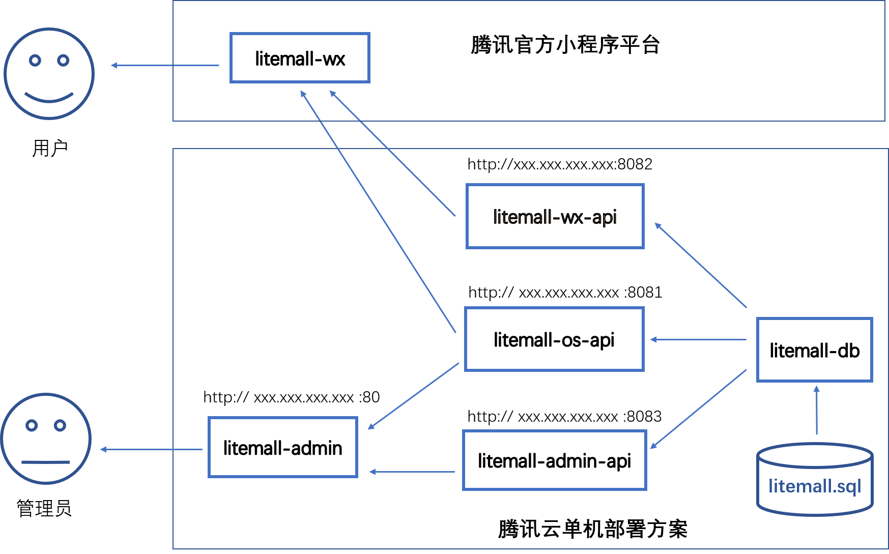

# 1 litemall系统

## 1.1 简介

litemall是一个简单的商场系统，基于现有的开源项目，重新实现一个完整的前后端项目，包含小程序客户端和网页管理端。

    


项目的架构是三个系统和六个模块：

* 基础系统(core)，由数据库、数据库业务模块litemall-db、对象存储模块litemall-os-api组成;
* 小商场系统(wxmall)，由litemall-wx-api模块和litemall-wx模块组成；
* 后台管理系统(admin)，由litemall-admin-api模块和litemall-admin模块组成。
* 简单商城系统(mall)，这里仅列出，目前没有开发计划。

而六个模块的开发设计到三种技术栈：

* Spring Boot技术栈，采用IDEA开发工具，开发litemall-db、litemall-os-api、litemall-admin-api和litemall-wx-api共四个模块；
* miniprogram（微信小程序）技术栈，采用微信小程序开发工具，开发litemall-wx模块；
* Vue技术栈，采用VSC开发工具，开发litemall-admin模块。

## 1.2 系统功能

从业务功能上，目前由五个业务模块（参考nideshop-mini-program和platform）组成：

* 会员业务模块
* 商场业务模块
* 商品业务模块
* 推广业务模块
* 系统业务模块（仅管理平台）

### 1.2.1 小程序端功能

* 首页

* 专题列表

* 专题详情

* 分类列表

* 分类详情

* 品牌列表

* 品牌详情

* 新品首发

* 人气推荐

* 商品搜索

* 商品详情

* 商品评价列表

* 商品评价

* 购物车

* 下单

* 我的主页

* 订单列表

* 订单详情

* 地址列表

* 地址添加

* 我的收藏

* 我的足迹

* 支付页面（待定）

* 优惠券选择（待定）

* 我的优惠券（待定）

### 1.2.2 管理平台功能

* 会员管理
  * 会员管理
  * 收货地址管理
  * 会员收藏
  * 会员足迹
  * 搜索历史
  * 购物车
  * 会员等级（待定）
  * 会员优惠劵（待定）
* 商城管理
  * 区域配置
  * 品牌制造商
  * 订单管理
  * 商品类目
  * 通用问题
  * 关键词
  * 渠道管理（待定）
* 商品管理
  * 商品管理
  * 商品参数
  * 商品规格
  * 货品管理
  * 用户评论
  * 团购设置（待定）
  * 商品满减搭配（待定）
* 推广管理
  * 广告列表
  * 专题管理
  * 优惠劵管理（待定）
* 系统管理
  * 管理员
  * 对象存储
  * 权限管理（待定）
  * 定时任务（待定）
  * 参数管理（待定）
  * 系统日志（待定）

## 1.3 项目特点

存在以下特点：

* 数据库方面，只是简单的表，表和表之间的依赖关系没有采用外键设计，而是依赖Java代码在service层面或者业务层面保证。这样做的好处是数据库频繁改动很方便，不会因为外键而导致数据库难以修改;
* 涉及三种技术栈，但是每种技术栈仅涉及最基础的技术；
  * 后端技术栈，仅涉及 Spring，Spring Boot, Spring MVC和Mybatis技术，其他后端技术暂时不采用;
  * 小程序技术栈，仅涉及miniprogram官方文档和nideshop-mini-program项目；
  * 前端技术栈，仅涉及vue, vuex, vue-route，element-ui技术和vue-element-admin项目；
* 安全方面，仅采用最基本的代码，提供简单基本的安全服务;
* 性能方面，没有涉及内存数据库缓存功能，而是完全依赖MySQL;
* 对象存储服务（图片上传和下载）方面，没有采用云存储方案，而是实现自有的简单文件上传下载功能。对象只是简单存储在后台主机的一个文件夹中，从而解耦当前项目对对象存储云平台的依赖，同时加强对对象存储概念的理解。

总之，目前的系统只是为了学习技术和业务而开发的一个简单商场原型系统。虽然缺失很多企业级功能，但是是完整和合理的原型系统。

注意：
> 以上特点并不一定是优点。

## 1.4 开发方案


如图所示，当前开发阶段的方案：

* MySQL数据访问地址`jdbc:mysql://localhost:3306/litemall`
* litemall-os-api对象存储服务地址`http://localhost:8081`
* litemall-wx-api后台服务地址`http://localhost:8082`，数据则来自MySQL
* litemall-admin-api后台服务地址`http://localhost:8083`,数据则来自MySQL
* litemall-admin前端访问地址`http://localhost:9527`, 数据来自litemall-admin-api
* litemall-wx没有前端访问地址，而是直接在微信小程序工具上编译测试开发，最终会部署到微信官方平台（即不需要自己部署web服务器），而数据则来自litemall-wx-api


### 1.4.1 Spring Boot开发环境

1. 安装JDK8
2. 安装maven
3. 安装Git（可选）
4. 安装IDEA Community
  建议安装maven插件和Git插件
5. IDEA导入本项目
6. 采用maven命令行或者IDEA的maven插件安装本项目依赖库
7. 编译本项目
8. 运行litemall-os-api, 打开浏览器，输入
    ```
    http://localhost:8081/storage/index/index
    ```
    如果出现JSON数据，则Spring Boot开发环境部署成功，litemall-os-api模块运行正常。
9. 同上，运行litemall-wx-api, 打开浏览器，输入 
    ```
    http://localhost:8082/wx/index/index
    ```
    如果出现JSON数据，则litemall-wx-api模块运行正常。
10. 同上，运行litemall-admin-api, 打开浏览器，输入 
    ```
    http://localhost:8083/admin/index/index
    ```
    如果出现JSON数据，则litemall-admin-api模块运行正常。

注意：
> 由于设置了三个不同的端口，因此开发时，IDEA可以同时运行litemall-os-api、litemall-wx-api和litemall-admin-api三个Spring Boot程序。

### 1.4.2 微信小程序开发环境

1. 安装微信小程序开发工具
2. 导入本项目的litemall-wx模块文件夹
3. 编译前，请确定litemall-wx-api模块已经运行，而litemall-wx模块的config文件夹中的api.js已经设置正确的后台数据服务地址；
4. 点击`编译`，如果出现数据和图片，则运行正常

### 1.4.3 Vue开发环境

1. 安装npm（或者cnpm）
2. 安装VSC（Visual Studio Code）
3. 导入本项目的litemall-admin模块文件夹
4. 安装依赖库
    
    ```
    cnpm install
    ```
5. 编译并运行
    
    ```
    cnpm run dev
    ```
    然后，打开浏览器，输入`http://localhost:9527`。
    如果出现管理后台登陆页面，则表明管理后台的前端运行正常；
6. 请确定litemall-admin-api模块已经运行，然后点击`登陆`，如果能够成功登陆，则表明管理后台的前端和后端对接成功，运行正常。

## 1.5 部署方案
 
在1.4节中介绍的是开发阶段时一些关键性开发流程。本节将介绍代码开发成功以后开始部署项目时一些关键性流程。

首先，需要明确的是开发时项目使用的服务地址是本地地址，即localhost；而部署时则应该根据具体情况设置合理的服务器地址和端口。

其次，需要明确的是各模块之间的关系：
  
  * litemall-os-api模块会包含litemall-db模块，部署在服务器中
  * litemall-wx-api模块会包含litemall-db模块，部署在服务器中
  * litemall-admin-api模块会包含litemall-db模块，部署在服务器中
  * litemall-wx模块部署在腾讯官方平台中，此外数据API地址指向litemall-wx-api所在服务qi地址
  * litemall-admin编译出的静态文件放在web服务器或者tomcat服务器，此外服务器地址设置指向3中litemall-admin-api所在地址
  
注意
> * 这里litemall-os-api、litemall-admin-api和litemall-wx-api也可以选择编译成jar模式的可执行文件（因为内嵌tomcat服务器），然后直接运行。
> * litemall-wx正式部署时需要设置https开头的合法域名，因此litemall-wx-api所在的服务器需要配置合适的域名和SSL证书，具体参见官方文档。

实际上，最终的部署方案是灵活的：

* 可以单一云主机中仅安装一个tomcat服务器并配置一个端口，然后同时部署四个项目的模块，从而提供四种服务
（即litemall-admin静态页面，litemall-os-api存储服务、litemall-amdin-api后台服务和litemall-wx-api后台服务）。
* 也可以是同一云主机中安装四个服务器分别配置四个端口，分别提供四种服务
* 也可以是四个云主机各自安装服务器配置端口，分别提供四种服务
* 当然，甚至多个服务器，并发提供服务。

注意
> 1. `本机`指的是是当前的开发机
> 2. `云主机`指的是用户购买并部署的远程主机

以下简单列举几种方案。

### 1.5.1 windows下本机测试部署方案

这里，我们是把window作为开发环境进行本项目的开发工作。
而项目开发完毕以后，在正式部署之前，可以先进行一个简单的本机测试部署方案。

首先，需要确保本地MySQL已经安装并且导入了litemall.sql数据；

其次，项目打包
```
cd litemall
mvn clean
mvn package
```
最后，本机测试性部署三个Spring Boot应用
```
cd litemall
java -jar ./litemall-os-api/target/litemall-os-api-0.1.0.jar &
java -jar ./litemall-wx-api/target/litemall-wx-api-0.1.0.jar &
java -jar ./litemall-admin-api/target/litemall-admin-api-0.1.0.jar &
```
如果，能够访问以下链接的数据，则表明本地测试部署成功：
```
http://localhost:8081/storage/index/index
http://localhost:8082/wx/index/index
http://localhost:8083/admin/index/index
```
 
注意
> 由于这里使用`&`设置成后台运行，因此测试结束以后，用户需要自行通过任务管理器或其他软件关闭这三个后台Spring Boot应用。

### 1.5.2 简单局域网方案

局域网方案，面向的是最终服务器数据和部分应用程序部署在局域网内的场景。

### 1.5.3 基于ubuntu腾讯云的单机云部署方案
单机云部署方案，面向的是服务器数据和应用部署在云主机单机中用于演示的场景。

主要流程是：创建云主机，安装ubuntu操作系统，按照JDK和MySQL应用运行环境，部署三个Spring Boot微服务后台应用，
以及部署后台静态文件。



#### 1.5.3.1 主机

请参考腾讯云官方文档进行相关操作。

1. 创建云主机虚拟机

2. 安装操作系统

   本项目采用ubuntu 16.04.1，但是并不限制其他操作系统。

3. 创建安全组

    

    目前允许的端口：8081，8082，8083，8080，80，443，22，3306
    
4. 设置SSH密钥（可选）

    建议用户设置SSH密钥，可以免密码登陆云主机，以及用于脚本自动上传应用。

5. 使用PuTTY远程登陆云主机

    如果用户设置SSH密钥，可以采用免密码登陆；否则采用账号和密码登陆。
    
#### 1.5.3.2 JDK8

https://www.digitalocean.com/community/tutorials/how-to-install-java-with-apt-get-on-ubuntu-16-04
http://www.webupd8.org/2012/09/install-oracle-java-8-in-ubuntu-via-ppa.html

```bash
sudo add-apt-repository ppa:webupd8team/java
sudo apt-get update
sudo apt-get install oracle-java8-installer
sudo apt-get install oracle-java8-set-default
```

警告
> "ppa:webupd8team/java" 不是Oracle官方PPA，可能存在安全隐患。

#### 1.5.3.3 MySQL

https://www.digitalocean.com/community/tutorials/how-to-install-mysql-on-ubuntu-16-04
https://www.linuxidc.com/Linux/2017-01/139502.htm

```
sudo apt-get update
sudo apt-get install mysql-server
sudo apt-get install mysql-client
```

下面是可选地设置root账号远程访问MySQL

1. MySQL默认不支持远程访问，因此需要修改配置文件
    ```
    sudo vi /etc/mysql/mysql.conf.d/mysqld.cnf
    ``` 
    添加'#'注释掉其中的`bind-address`,
    ```
    #bind-address= 127.0.0.1`;
    ```

2. 设置root账号远程访问权限
    ```
    mysql -u root -p
    GRANT ALL PRIVILEGES ON *.* TO 'root'@'%' IDENTIFIED BY '123456' WITH GRANT OPTION;
    FLUSH PRIVILEGES;
    quit;
    ```
3. 登陆腾讯云，设置云主机的`安全组`，允许`3306`端口访问，然后重启云主机，使得这些配置生效。

警告
> 1. 因为安全的原因，MySQL不应该设置远程访问，
> 这里仅仅用于方便数据导入操作。
> 2. MySQL应该部署在专门的服务器中，
> 这里仅仅用于演示远程部署MySQL。

#### 1.5.3.4 litemall数据

这里可以采用命令行式，也可以采用MySQL自带的Workbench导入。

* 命令行导入

1. 采用FileZilla把本项目的litemall.sql上传到云主机
2. 使用PuTTY登陆云主机
3. 进入MySQL，输入上节所设置的MySQL的root密码
4. 创建数据库、 创建用户并分配访问权限
5. 导入数据
6. 退出

* MySQL Workbench导入

1. 先确认已经在1.4.3节中设置了root可以远程访问；
2. 创建一个新的连接，设置`Hostname` 、`Username` 和`Password`，
然后点击`Test Connection`测试是否能够连接到云主机；
如果测试成功，则进入；

3. 用户自行学习文档，完成`创建数据库`、`创建用户`和`分配权限`三个操作；
4. 利用Workbench的`Server`菜单下的`Data Import`完成数据导入。

#### 1.5.3.5 Tomcat

1. 本项目中采用二进制jar包方式来部署Spring Boot后端应用，因此可以不需要部署在tomcat中。
但是，litemall-admin前端项目最终会编译出静态文件，需要部署在服务器中，因此这里仍需安装tomcat(或者其他服务器)。

    ```bash
    sudo apt-get install tomcat8
    ```

2. 为了配置tomcat支持外部文件夹中，修改tomcat的server文件的`Host`标签
  
    ```bash
    sudo vi /var/lib/tomcat8/conf/server.xml
    ```
    在其中添加一行新的内容
    ```
    <Host>
    ...
    <Context path="/" docBase="/home/ubuntu/deploy/litemall-admin/dist" reloadable="true" />
    ...
    </Host>
    ```
    
3. 重启tomcat

    ```
    sudo service tomcat8 restart
    ```


#### 1.5.3.5 项目打包

1. Spring Boot打包

通常项目打包方案存在两种：

* 一是打包war格式，因此云主机需要专门安装tomcat
* 二是打包可执行jar格式，此时内部包含嵌入式tomcat

这里仅采用第二种方案，简化tomcat的安装配置过程。

采用如下命令进行项目打包

```
cd litemall
mvn clean
mvn package
```
此时，在litemall-os-api项目的target文件夹中看到litemall-os-xxx.jar；
在litemall-wx-api项目的target文件夹中看到litemall-wx-xxx.jar；
在litemall-admin-api项目的target文件夹中看到litemall-admin-xxx.jar。

2. Vue项目打包

采用如下命令进行项目打包

````bash
cd litemall/litemall-admin
cnpm run build:prod
````

此时，litemall-admin模块的dist文件夹中就是最终部署时的代码，可以先压缩，上传到云主机，再解压缩。

#### 1.5.3.6 项目部署运行

https://docs.spring.io/spring-boot/docs/1.5.10.RELEASE/reference/htmlsingle/#deployment-service

1. 项目进一步打包到deploy文件夹中：
   * litemall-os-api模块编译得到的litemall-os-api-xxx.jar 保存到deploy的litemall-os-api文件夹中，同时重命名成litemall-os-api.jar
   * litemall-wx-api模块编译得到的litemall-wx-api-xxx.jar 保存到deploy的litemall-wx-api文件夹中，同时重命名成litemall-wx-api.jar
   * litemall-admin-api模块编译得到的litemall-admin-api-xxx.jar 保存到deploy的litemall-admin-api文件夹中，同时重命名成litemall-admin-api.jar
   * litemall-admin模块编译以后，把dist文件夹压缩，然后放到deploy的litemall-admin文件夹中。
   
2. 使用FileZilla把deploy整个文件夹上传到云主机的/home/ubuntu文件夹中

3. 使用PuTTY登陆云主机

4. 运行脚本部署运行

    ```bash
    sudo ./deploy/bin/deploy.sh
    ```
    
 
5. 测试部署是否成功

    请确保云主机的安全组已经允许相应的端口（见1.5.3.1）；
    然后测试是否部署成功(xxx.xxx.xxx.xxx是云主机IP）：

    ```
    http://xxx.xxx.xxx.xxx:8081/storage/index/index
    http://xxx.xxx.xxx.xxx:8082/wx/index/index
    http://xxx.xxx.xxx.xxx:8083/admin/index/index
    http://xxx.xxx.xxx.xxx:8080/#/login
    ```

6. 自动上传脚本

    为了简化步骤1和步骤2，完成了util/upload.sh脚本，用户需要设置相应的云主机IP和密钥文件路径