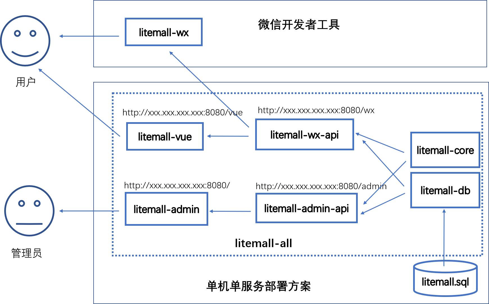

# 1 litemall系统

## 1.1 简介

litemall是一个简单的商场系统，基于现有的开源项目，重新实现一个完整的前后端项目，包含小程序客户端和网页管理端。

    


项目的架构是三个系统和六个模块：

* 基础系统子系统(core)

  由数据库、litemall-cre模块、litemall-db模块、litemall-os-api模块和litemall-all模块组成;

* 小商场子系统(wxmall)

  由litemall-wx-api模块和litemall-wx模块组成；

* 后台管理子系统(admin)

  由litemall-admin-api模块和litemall-admin模块组成。

* 简单商城系统(mall)

  这里仅列出，目前没有开发计划。

而六个模块的开发设计到三种技术栈：

* Spring Boot技术栈

  采用IDEA开发工具，开发litemall-core、litemall-db、litemall-all、
  litemall-os-api、litemall-admin-api和litemall-wx-api共六个个模块；
  
* miniprogram（微信小程序）技术栈

  采用微信小程序开发工具，开发litemall-wx模块；
  
* Vue技术栈

  采用VSC开发工具，开发litemall-admin模块。

## 1.2 系统功能

从业务功能上，目前由五个业务模块组成：

* 会员业务模块
* 商场业务模块
* 商品业务模块
* 推广业务模块
* 系统业务模块

### 1.2.1 小程序端功能

* 首页
* 专题列表
* 专题详情
* 分类列表
* 分类详情
* 品牌列表
* 品牌详情
* 新品首发
* 人气推荐
* 商品搜索
* 商品详情
* 商品评价列表
* 商品评价
* 购物车
* 下单
* 我的主页
* 订单列表
* 订单详情
* 地址列表
* 地址添加
* 我的收藏
* 我的足迹
* 支付页面（待定）
* 优惠券选择（待定）
* 我的优惠券（待定）

### 1.2.2 管理平台功能

* 会员管理
  * 会员管理
  * 收货地址管理
  * 会员收藏
  * 会员足迹
  * 搜索历史
  * 购物车
  * 会员等级（待定）
  * 会员优惠劵（待定）
* 商城管理
  * 区域配置
  * 品牌制造商
  * 订单管理
  * 商品类目
  * 通用问题
  * 关键词
  * 渠道管理（待定）
* 商品管理
  * 商品管理
  * 商品参数
  * 商品规格
  * 货品管理
  * 用户评论
  * 团购设置（待定）
  * 商品满减搭配（待定）
* 推广管理
  * 广告列表
  * 专题管理
  * 优惠劵管理（待定）
* 系统管理
  * 管理员
  * 对象存储
  * 权限管理（待定）
  * 定时任务（待定）
  * 参数管理（待定）
  * 系统日志（待定）

## 1.3 项目特点

存在以下特点：

* 数据库方面，只是简单的表，表和表之间的依赖关系没有采用外键设计，而是依赖Java代码在service层面或者业务层面保证。这样做的好处是数据库频繁改动很方便，不会因为外键而导致数据库难以修改;
* 涉及三种技术栈，但是每种技术栈仅涉及最基础的技术；
  * 后端技术栈，仅涉及 Spring，Spring Boot, Spring MVC和Mybatis技术，其他后端技术暂时不采用;
  * 小程序技术栈，仅涉及miniprogram官方文档和nideshop-mini-program项目；
  * 前端技术栈，仅涉及vue, vuex, vue-route，element-ui技术和vue-element-admin项目；
* 安全方面，仅采用最基本的代码，提供简单基本的安全服务;
* 性能方面，没有涉及内存数据库缓存功能，而是完全依赖MySQL;
* 对象存储服务（图片上传和下载）方面，没有采用云存储方案，而是实现自有的简单文件上传下载功能。对象只是简单存储在后台主机的一个文件夹中，从而解耦当前项目对对象存储云平台的依赖，同时加强对对象存储概念的理解。
* 部署方便，支持多服务部署和一键部署脚本，也支持war项目安装包部署。
* 文档全面，虽然还在开发中，但是规划中文档和代码注释一定会完成，帮助开发者理解项目。

总之，目前的系统只是为了学习技术和业务而开发的一个简单商场原型系统。虽然缺失很多企业级功能，但是是完整和合理的原型系统。

注意：
> 以上特点并不一定是优点。

接下来，从项目的开发、部署（测试）和上线三个阶段介绍litemall。


首先需要明确的是三个不同阶段：

* dev

即develop或者development, 这里指开发阶段，通常代码是直接在本地编译、运行和测试。
此外，这里服务访问地址通常是localhost。这里的“用户”主要是指开发者本身。

* dep

即deploy或者deployment，这里指部署（测试阶段），通常代码已经编译打包运行在远程主机中，
可以对外服务。此外，这里服务访问地址通常是IP地址。如果IP是公网IP，那么
部署以后就可以对外服务；如果是内网地址，那么只能内网访问。这里的“用户”主要是
指开发者本身、测试者；当然，如果是局域网或者不介意IP访问的，那么这里的“用户”
也可能是最终使用者用户。

* prod

即product或者production，这里指上线阶段，通常也是代码编译打包运行在远处主机中可以对外服务。
此外，这里服务访问地址通常是域名地址，同时端口是80web端口。上线以后直接面向的是最终用户。
虽然服务的代码本身和dep是完全一样的，但是考虑到场景的不同，上线阶段可能在运行环境方面需要做
调整，例如采用反向代理屏蔽内部实际项目结构。此外，最大的不同应该是上线环境下要使用域名和80端口，
而部署阶段则更为自由。

其次，需要明确的是，这里划分三种阶段不是简单的文档说明，还直接影响项目本身的行为
和代码编译结果，因此开发者需要清晰的了解：

* dev
  项目的各个模块采用dev来编译配置代码行为。
  * vue技术栈的模块采用dev配置文件编译，见litemall-admin/config/dev.env.js
  * 小程序技术栈的模块采用dev配置，见litemall-wx/config/api.js
  * spring boot技术栈的模块采用dev配置，例如见litemall-wx-api/src/main/resources/application-dev.properties，
    此外，在代码中也可以采用`Profile(dev)`来直接定义代码在dev阶段的行为。

* dep
  项目的各个模块采用dep来编译配置代码行为。
  * vue技术栈的模块采用dep配置文件编译，见litemall-admin/config/dep.env.js
  * 小程序技术栈的模块采用dep配置，见litemall-wx/config/api.js
  * spring boot技术栈的模块采用dep配置，例如见litemall-wx-api/src/main/resources/application-dep.properties，
    此外，在代码中也可以采用`Profile(dep)`来直接定义代码在dev阶段的行为。
    
* prod
  项目的各个模块采用prod来编译配置代码行为。
  * vue技术栈的模块采用prod配置文件编译，见litemall-admin/config/prod.env.js
  * 小程序技术栈的模块采用prod配置，见litemall-wx/config/api.js
  * spring boot技术栈的模块采用prod配置，例如见litemall-wx-api/src/main/resources/application-prod.properties，
    此外，在代码中也可以采用`Profile(prod)`来直接定义代码在dev阶段的行为。
  
最后，其实dep和prod不存在先后关系。例如，如果开发者已经存在域名和生产环境，可以直接
跳过dep阶段，而直接部署在线上环境中。因此有些时候，这里部署和上线是一个阶段。

当然，这里仍然建议先dep后prod，是因为对于第一次开发而言，先dep阶段可以避免对域名、https证书等非业务相关工作的干扰。

此外，有些业务功能（例如微信支付）必须是域名访问，那么开发和部署阶段可以先采用模拟或跳过的形式，
先不开发和测试这样业务功能，等其他功能开发完毕和部署测试成功以后，再来开发这些线上环境才能
运行的功能，此时会有一个好的基础。

注意：
> 以上三种阶段是基于个人理解，有可能有误或不当的地方。
> 此外，可能有人会认为需要存在测试阶段置于dev和dep之间。
> 但是，本人认为测试过程存在于三个不同阶段内部可能更为适宜，
> 即项目测试过程这里不会作为独立的一个阶段。
> 当然，这里也可以把dep阶段理解成是一种测试阶段。

讨论：
> 对于内网IP，例如"192.168.0.1"，是应该认为属于开发阶段的配置，还是应该认为属于部署阶段的配置？
> 本人认为，这里可能不一定，看开发者的实际需要，不过更倾向于开发阶段。
>
> 场景1，开发者本机是"192.168.0.1"，那么此时litemall-wx模块的api.js中，如果采用localhost，那么
> 本机的微信开发者工具可以访问，但是局域网内手机测试则不能访问；而如果采用本机的IP地址，那么
> 本机微信开发者工具可以访问，同时局域网内手机测试也能访问。此时，设置IP地址应该属于开发阶段。
>
> 场景2，局域网内管理后台代码部署到局域网服务器中，用户基于局域网的内网IP来访问管理平台，
> 此时，设置IP地址应该属于部署阶段（甚至可以认为是“上线阶段”）。

## 1.4 开发方案


如图所示，当前开发阶段的方案：

* MySQL数据访问地址`jdbc:mysql://localhost:3306/litemall`
* litemall-os-api对象存储服务地址`http://localhost:8081`
* litemall-wx-api后台服务地址`http://localhost:8082`，数据则来自MySQL
* litemall-admin-api后台服务地址`http://localhost:8083`,数据则来自MySQL
* litemall-admin前端访问地址`http://localhost:9527`, 数据来自litemall-admin-api
* litemall-wx没有前端访问地址，而是直接在微信小程序工具上编译测试开发，最终会部署到微信官方平台（即不需要自己部署web服务器），而数据则来自litemall-wx-api


### 1.4.0 数据库

按照开发环境前，需要先在本地配置好数据库：

1. 本项目目前采用MySQL，请上网下载安装MySQL 5.7.x

   注意：
   > 1. MySQL必须安装5.7.x, 如果是5.6或者最新的8.0都会存在错误。
   >   目前原因还没有找到（可能是采用JSON引起），希望开发者注意或者有好的解决方案。
   > 2. 如果采用IDE工具导入数据，建议采用MySQL Workbench。如果采用navicat可能有时导入失败。
   >    这里失败的原因应该是sql文件是MySQL Workbench导出的，因此可能存在不兼容的格式。

2. 数据库文件存放在litemall-db/sql文件夹中，其中litemall_schema.sql创建数据库和用户权限，
   而litemall.sql则是具体的表和数据。开发者可以采用命令或者软件导入数据。
   
   注意：
   > 不要运行nideshop.sql文件，这只是所参考nideshop项目的原始数据库，仅用于对比。

### 1.4.1 Spring Boot开发环境

1. 安装JDK8
2. 安装Maven
3. 安装Git（可选）
4. 安装IDEA Community，建议安装Maven插件和git插件。Eclipse没有试过，但是应该也是可行的。
5. IDEA导入本项目
6. 采用Maven命令安装依赖库

   例如：
   ```
   cd litemall
   mvn install
   ```
   
   或者采用IDEA的Maven插件安装本项目依赖库，点击`install`

  

7. 采用Maven命令编译本项目

   例如：
   ```
   cd litemall
   mvn compile
   ```

   此时可以看到，litemall-os-api等模块多了target文件夹，里面是编译出的文件。
   
   或者采用IDEA的Maven插件编译本项目，点击`compile`
   
   如果采用IDEA也可以跳过当前步骤，直接步骤8（因为运行时会自动编译再运行）。
   
8. 采用Maven命令运行本项目的litemall-os-api模块。

   例如：
   ```
   cd litemall/litemall-os-api
   mvn spring-boot:run
   ```
   

   或者采用IDEA，打开litemall-os-api模块的Application类
   右键` Run Application.main()`方式运行该模块
   
   

   打开浏览器，输入
    ```
    http://localhost:8081/os/index/index
    ```
    如果出现JSON数据，则Spring Boot开发环境部署成功，litemall-os-api模块运行正常。

9. 采用Maven命令运行本项目的litemall-wx-api模块。

   例如：
   ```
   cd litemall/litemall-wx-api
   mvn spring-boot:run
   ```
   
   如果采用IDEA，则litemall-wx-api模块的Application类
   右键` Run Application.main()`方式运行该模块,
   
   打开浏览器，输入
    ```
    http://localhost:8082/wx/index/index
    ```
    如果出现JSON数据，则litemall-wx-api模块运行正常。
    
8. 采用Maven命令运行本项目的litemall-admin-api模块。

   例如：
   ```
   cd litemall/litemall-admin-api
   mvn spring-boot:run
   ```
   
   如果采用IDEA，则litemall-admin-api模块的Application类
   右键` Run Application.main()`方式运行该模块,
   
   打开浏览器，输入
   ```
    http://localhost:8083/admin/index/index
    ```
    如果出现JSON数据，则litemall-admin-api模块运行正常。

注意：
> 1. 由于设置了三个不同的端口，因此开发时，IDEA可以同时运行
>    litemall-os-api、litemall-wx-api和litemall-admin-api三个Spring Boot程序。
> 2. 有些熟悉IDE配置tomcat运行项目的开发者可能会运行litemall-all模块来运行整个项目，
>    这里是不建议的，甚至可能会出现错误的：
>    * 实际上litemall-all模块的作用仅仅是打包war项目包，然后用于部署阶段。
>      此外，目前本人也没有尝试过在IDEA中配置tomcat运行项目。
>    * Spring Boot开发通常也是采用直接运行Application的main方法，
>      因此熟悉IDE配置tomcat的开发者也应该切换思路。
>    * 当前文档的开发和测试都是基于三个服务同时运行存在三个端口的情况，
>      因此如果开发时采用IDE配置tomcat的方式，实践过程中可能会和文档不一致。
> 3. 在上述开发步骤中，既介绍了Maven命令方式，也介绍了IDEA方式，但是仍然建议
>    开发时采用IDEA即可。
> 4. 以上是本人开发过程中采用的一些步骤，开发者可不拘泥于这些步骤。

### 1.4.2 微信小程序开发环境

1. 安装微信小程序开发工具
2. 导入本项目的litemall-wx模块文件夹
3. 编译前，请确定litemall-wx-api模块已经运行，而litemall-wx模块的config文件夹中的api.js已经设置正确的后台数据服务地址；
4. 点击`编译`，如果出现数据和图片，则运行正常

注意：
> 1. 开发者编译以后，可以看到图片和数据，但是采用微信登录是肯定会失败的。
>    原因是这里的appid是本人申请的，而开发者不是本人app的开发者或体验者，
>    因此微信登录导致后台服务向微信服务器交互时会失败。
> 2. 有的开发者可能认为把litemall-wx模块的appid设置成开发者自己的appid就可以，
>    但是由于小商场的云主机后台服务的appid仍然是本人appid，因此微信登录时仍然会失败。
> 3. 开发者可以在litemall-wx和litemall-wx-api中设置自己的appid，以及部署自己的后台服务，
>    相关内容请阅读章节3。或者，开发者可以采用账号登录方式登录，然后体验商品购买下单的方式。
> 4. 由于没有设置商户支付信息，因此开发者在付款时会失败。相关内容阅读章节3。

### 1.4.3 Vue开发环境

1. 安装npm（或者cnpm）
2. 安装VSC（Visual Studio Code）
3. 导入本项目的litemall-admin模块文件夹
4. 安装依赖库
    
    ```
    cnpm install
    ```
    
5. 编译并运行
    
    ```
    cnpm run dev
    ```
    然后，打开浏览器，输入`http://localhost:9527`。
    如果出现管理后台登录页面，则表明管理后台的前端运行正常；
    
6. 请确定litemall-admin-api模块已经运行，然后点击`登录`，如果能够成功登录，则表明管理后台的前端和后端对接成功，运行正常。

## 1.5 部署方案
 
在1.4节中介绍的是开发阶段时一些关键性开发流程。本节将介绍代码开发成功以后开始部署项目时一些关键性流程。

首先，需要明确的是开发时项目使用的服务地址是本地地址，即localhost；而部署时则应该根据具体情况设置合理的服务器地址和端口。

其次，需要明确的是各模块之间的关系：
  
  * litemall-os-api模块会包含litemall-core模块和litemall-db模块，部署在服务器中
  * litemall-wx-api模块会包含litemall-core模块和litemall-db模块，部署在服务器中
  * litemall-admin-api模块会包含litemall-core模块和litemall-db模块，部署在服务器中
  * litemall-wx模块部署在微信开发者工具中，此外数据API地址指向litemall-wx-api所在服务qi地址
  * litemall-admin编译出的静态文件放在web服务器或者tomcat服务器，此外服务器地址设置指向3中litemall-admin-api所在地址
  
最后，**如果项目部署，则根据开发者的部署环境在以下文件中或代码中修改相应的配置。**

1. MySQL数据库设置合适的用户名和密码等信息，同时在litemall-os-api、litemall-wx-api和litemall-admin-api模块
   的`resources/application-dep.properties` 中设置正确的数据库配置信息。
2. litemall-wx模块`config/api.js`设置正确的`WxApiRoot`和`StorageApi`。
   如果采用第三方对象存储服务，`StorageApi`指向第三方即可。
3. litemall-wx-api模块的`resources/application-dep.properties` 中设置所申请的微信小程序APPID和微信支付等信息。
4. litemall-os-api模块`resources/application-dep.properties` 中设置litemall-os-api服务所在的IP和端口地址
   ```
   org.linlinjava.litemall.os.address=http://xxx.xxx.xxx.xxx
   org.linlinjava.litemall.os.port=8081
   ```
   如果采用第三方对象存储服务，那么litemall-os-api可以不部署，这里的配置开忽略。
5. litemall-admin模块`config/dep.env.js`中设置正确的`BASE_API`和`OS_API`。
   如果采用第三方对象存储服务，`OS_API`指向第三方即可。

实际上，最终的部署方案是灵活的：

* 可以单一云主机中仅安装一个tomcat服务器并配置一个端口，然后同时部署四个项目的模块，从而提供四种服务
（即litemall-admin静态页面，litemall-os-api存储服务、litemall-amdin-api后台服务和litemall-wx-api后台服务）。
* 也可以是同一云主机中安装四个服务器分别配置四个端口，分别提供四种服务
* 也可以是四个云主机各自安装服务器配置端口，分别提供四种服务
* 当然，甚至多个服务器，并发提供服务。

注意
> 1. `本机`指的是是当前的开发机
> 2. `云主机`指的是开发者购买并部署的远程主机

以下简单列举几种方案。

### 1.5.3 单机云部署方案

本节介绍基于腾讯云的单机云部署方案，面向的是服务器数据和应用部署在云主机单机中用于演示的场景。
其他云应该也是可行的。

主要流程是：创建云主机，安装ubuntu操作系统，按照JDK和MySQL应用运行环境，部署三个Spring Boot微服务后台应用，
以及部署管理后台静态文件到tomcat。


#### 1.5.3.1 主机

请参考腾讯云官方文档进行相关操作。

1. 创建云主机虚拟机

2. 安装操作系统

   本项目采用ubuntu 16.04.1，但是并不限制其他操作系统。

3. 创建安全组

    

    目前允许的端口：8081，8082，8083，8080，80，443，22，3306
    
4. 设置SSH密钥（可选）

    建议开发者设置SSH密钥，可以免密码登录云主机，以及用于脚本自动上传应用。

5. 使用PuTTY远程登录云主机

    如果开发者设置SSH密钥，可以采用免密码登录；否则采用账号和密码登录。
    
#### 1.5.3.2 JDK8

https://www.digitalocean.com/community/tutorials/how-to-install-java-with-apt-get-on-ubuntu-16-04

http://www.webupd8.org/2012/09/install-oracle-java-8-in-ubuntu-via-ppa.html

```bash
sudo add-apt-repository ppa:webupd8team/java
sudo apt-get update
sudo apt-get install oracle-java8-installer
sudo apt-get install oracle-java8-set-default
```

警告
> "ppa:webupd8team/java" 不是Oracle官方PPA，可能存在安全隐患。

#### 1.5.3.3 MySQL

https://www.digitalocean.com/community/tutorials/how-to-install-mysql-on-ubuntu-16-04

```
sudo apt-get update
sudo apt-get install mysql-server
sudo apt-get install mysql-client
```

下面是可选地设置root账号远程访问MySQL

1. MySQL默认不支持远程访问，因此需要修改配置文件
    ```
    sudo vi /etc/mysql/mysql.conf.d/mysqld.cnf
    ``` 
    添加'#'注释掉其中的`bind-address`,
    ```
    #bind-address= 127.0.0.1`;
    ```

2. 设置root账号远程访问权限
    ```
    mysql -u root -p
    GRANT ALL PRIVILEGES ON *.* TO 'root'@'%' IDENTIFIED BY '123456' WITH GRANT OPTION;
    FLUSH PRIVILEGES;
    quit;
    ```
3. 登录腾讯云，设置云主机的`安全组`，允许`3306`端口访问，然后重启云主机，使得这些配置生效。

警告
> 1. 因为安全的原因，MySQL不应该设置远程访问，
> 这里仅仅用于方便数据导入操作。
> 2. MySQL应该部署在专门的服务器中，
> 这里仅仅用于演示远程部署MySQL。

#### 1.5.3.4 litemall数据

这里可以采用命令行式，也可以采用MySQL自带的Workbench导入。

* 命令行导入

  1. 采用FileZilla把本项目的litemall.sql上传到云主机
  2. 使用PuTTY登录云主机
  3. 进入MySQL，输入上节所设置的MySQL的root密码
  4. 创建数据库、 创建用户并分配访问权限
  5. 导入数据
  6. 退出

* MySQL Workbench导入

  1. 先确认已经在1.4.3节中设置了root可以远程访问；
  2. 创建一个新的连接，设置`Hostname` 、`Username` 和`Password`，
     然后点击`Test Connection`测试是否能够连接到云主机；
     如果测试成功，则进入；
     
  3. 开发者自行学习文档，完成`创建数据库`、`创建用户`和`分配权限`三个操作；
  4. 利用Workbench的`Server`菜单下的`Data Import`完成数据导入。

* 命令脚本
    
    ```bash
    cd deploy
    mysql -h localhost -u root -p123456 
    source ./litemall-db/litemall_schema.sql 
    source ./litemall-db/litemall.sql 
    ```

    其中123456是开发者所设置的MySQL的管理员密码。

#### 1.5.3.5 Tomcat/Nginx

本项目中采用二进制jar包方式来部署Spring Boot后端应用，因此可以不需要部署在tomcat中。
但是，litemall-admin前端项目最终会编译出静态文件，需要部署在服务器中，
因此这里需要安装tomcat或者nginx(或者其他服务器)。

这里可能有点绕：

1. 开发方案，无需tomcat/nginx，直接用VSC即可；
2. 部署方案，采用tomcat，这里是因为80端口可能需要云主机备案因此采用tomcat使用8080端口；
3. 上线方案. 采用nginx，通过反向代理访问后台服务。

因此目前这里采用tomcat部署静态文件，通过8080端口访问管理后台。
当然，这里没有严格限制，开发者也可以直接配置好nginx，在部署方案就使用nginx来
部署静态文件服务，通过web端口80访问管理后台。

* Tomcat部署静态文件

  1. 安装tomcat
    ```bash
    sudo apt-get install tomcat8
    ```

  2. 配置tomcat指向`delpoy/litemall-admin/dist`目录
  
    ```bash
    sudo vi /var/lib/tomcat8/conf/server.xml
    ```
    在其中添加一行新的内容
    ```
    <Host>
    ...
    <Context path="/" docBase="/home/ubuntu/deploy/litemall-admin/dist" reloadable="true" />
    ...
    </Host>
    ```
    
  3. 运行/重启tomcat

    ```
    sudo service tomcat8 stop
    sudo service tomcat8 start
    sudo service tomcat8 restart
    ```

* Nginx部署静态文件

  这里可以参考http://www.nginx.cn/4723.html
  
  1. 安装nginx
  
    ```bash
      sudo apt-get update
      sudo apt-get install nginx
    ```
  
  2. 配置nginx指向`delpoy/litemall-admin/dist`目录
  
  3. 运行/重启nginx
      ```
      sudo service nginx stop
      sudo service nginx start
      sudo service nginx restart
      ```
    
#### 1.5.3.6 项目打包

这里项目打包括两种：

1. Spring Boot打包

    采用如下命令进行项目打包

    ```
    cd litemall
    mvn clean
    mvn package
    ```

    此时，在litemall-os-api项目的target文件夹中看到litemall-os-xxx.jar；
    在litemall-wx-api项目的target文件夹中看到litemall-wx-xxx.jar；
    在litemall-admin-api项目的target文件夹中看到litemall-admin-xxx.jar。

2. Vue项目打包

    采用如下命令进行项目打包

    ````bash
    cd litemall/litemall-admin
    cnpm run build:dep
    ````

    此时，litemall-admin模块的dist文件夹中就是最终部署时的代码，可以先压缩，上传到云主机，再解压缩。

#### 1.5.3.7 项目部署运行

https://docs.spring.io/spring-boot/docs/1.5.10.RELEASE/reference/htmlsingle/#deployment-service

1. 项目进一步打包到deploy文件夹中：
   * litemall-os-api模块编译得到的litemall-os-api-xxx-exec.jar 保存到deploy的litemall-os-api文件夹中，同时重命名成litemall-os-api.jar
   * litemall-wx-api模块编译得到的litemall-wx-api-xxx-exec.jar 保存到deploy的litemall-wx-api文件夹中，同时重命名成litemall-wx-api.jar
   * litemall-admin-api模块编译得到的litemall-admin-api-xxx-exec.jar 保存到deploy的litemall-admin-api文件夹中，同时重命名成litemall-admin-api.jar
   * litemall-admin模块编译以后，把dist文件夹压缩，然后放到deploy的litemall-admin文件夹中。
   
2. 使用FileZilla把deploy整个文件夹上传到云主机的/home/ubuntu文件夹中

3. 使用PuTTY登录云主机

4. 如果开发者没有部署litemall数据库，可以运行以下命令：

    ```bash
    cd deploy
    mysql -h localhost -u root -p123456 
    source ./litemall-db/litemall_schema.sql 
    source ./litemall-db/litemall.sql 
    ```
    注意，123456是开发者所设置的MySQL管理员密码
    警告：
    > litemall_schema.sql会尝试删除litemall数据库然后重建一个新的数据。

5. 运行脚本部署运行

    ```bash
    sudo ./deploy/bin/deploy.sh
    ```

    

6. 测试部署是否成功
  
    请确保云主机的安全组已经允许相应的端口（见1.5.3.1）；
    然后测试是否部署成功(xxx.xxx.xxx.xxx是云主机IP）：

    ```
    http://xxx.xxx.xxx.xxx:8081/os/index/index
    http://xxx.xxx.xxx.xxx:8082/wx/index/index
    http://xxx.xxx.xxx.xxx:8083/admin/index/index
    http://xxx.xxx.xxx.xxx:8080/#/login
    ```

#### 1.5.3.8 部署脚本

为了简化步骤1和步骤2，完成了deploy/util/upload.sh上传脚本和deploy/util/lazy.sh部署脚本，
    
注意：
> 1. 开发者需要在deploy/util/upload.sh和deploy/util/lazy.sh中设置相应的云主机登录账号和密钥文件路径。
> 2. 开发者需要在deploy/util/reset.sh设置云主机的MySQL的root登录账户。
> 3. 请先执行1.5.3中上述步骤，确保部署环境成功。
    
* 上传脚本
    
该脚本会自动把当前项目不同模块下的最终部署文件复制到deploy文件夹中，然后上传到云主机。
该上传脚本没有自动做Spring Boot项目打包和Vue项目打包工作
   
* 部署脚本
    
该脚本会编译项目，再上传deploy文件，最后ssh登录远程主机执行bin下面的deploy.sh脚本。
  
注意，运行命令必须在项目主目录中，类似如下命令：
```bash
cd litemall
./deploy/util/lazy.sh
```

注意：
> 本项目的deploy文件夹以及其中的部署相关脚本只能适用于本节部署方式。
> 目前灵活性较差，开发者可以参考实现自己的相关脚本，简化开发工作。

### 1.5.4 集群式云部署方案

由于本项目是面向微小型企业的小商城系统，因此预期的分布式部署方案是

1. 专门的云数据库部署数据
2. 专门的云存储方案
3. 专门的CDN分发管理后台的静态文件
4. 一台云主机部署管理后台的后台服务
5. 一台或多台云主机部署小商场的后台服务

虽然由于环境原因没有正式测试过，但是这种简单的集群式场景应该是可行的。
在1.5.3节中所演示的四个服务是独立的，因此延伸到这里分布式是非常容易的。

但是，如果需要实现互联网式分布式云部署，目前的项目架构和方案不支持。
至少每个功能模块应该是独立服务系统。此外，需要引入单点登录系统、集群、缓存
和消息队列等多种技术。因此如果开发者需要这种形式的分布式方案，请参考其他项目。

### 1.5.5 war部署方案

这里介绍另外一种单主机单服务的war部署方案，即四个服务打包成一个war格式的项目部署包。



和1.5.3节相比，采用这样方案的原因是：

1. 安装方便，是传统的web项目安装方式，在tomcat里面部署一个war项目包，即可完成安装；
2. 内存消耗少。在1.5.3节中四个独立的java环境消耗的内存大概1.2G多，而这里部署以后
只需要一个java环境，因此消耗内存只有1.5.3节方案的四分之一，适合1G云主机部署。
3. 只存在一个域名和端口，没有多个服务之间依赖关系。

具体的打包部署方案是；

1. litemall-admin首先需要先编译得到静态文件；
2. 采用`mvn package`命令，litemall-all模块自动生成war格式的安装包，里面
   包含了三个后台服务和静态文件；
3. 把这个安装包手动或采用其他方式部署云主机的tomcat服务器。

更多细节阅读2.5节litemall-all模块。

注意：
> 虽然这里介绍了这种方案，但是本项目的开发、测试和部署是基于1.5.3方案，
> 因此开发者可能需要做一些配置方面的调整，例如三个后台服务地址调整。


## 1.6 上线方案

在1.5节部署方案中，我们介绍了多种部署的方案，但是实际上这些方案都不能立即用于正式环境：

1. 正式环境需要域名和HTTPS证书
2. 小商场的小程序端对服务器域名存在接入要求。

本节采用`www.example.com`域名作为示例。

注意
> `www.example.com`仅作为实例，不是真实环境下的域名。

这里列举一种可行的单机上线方案，开发者可以基于自身业务采用其他上线方案。

### 1.6.1 域名

1. 注册域名，通常商业性的网站采用`.com`
2. 解析域名到服务器公网IP，采用`ping`命令查看是否解析成功
3. 备案

### 1.6.2 nginx

https://www.digitalocean.com/community/tutorials/how-to-install-nginx-on-ubuntu-16-04

在部署方案中建议安装了tomcat来访问管理后台，而这里上线方案中则建议使用nginx，
此时我们可以卸载tomcat（当然不卸载也可以，即同时支持8080端口访问）。

#### 1.6.2.1 nginx安装

采用命令
```bash
sudo apt-get update
sudo apt-get install nginx
```

有的文档会指出需要防火墙设置，但是腾讯云主机防火墙默认没有开启。
开发者这里自己可以开启设置，或者直接不开启。

打开浏览器，输入以下地址：
```
http://www.example.com
```

此时，如果看到nginx的欢迎页面，则安装成功。

安装以后：
* `/var/www/html`：默认静态web文件目录
* `/etc/nginx`:
* `/etc/nginx/nginx.conf`:
* `/etc/nginx/sites-avaiable`:
* `/etc/nginx/sites-enabled`:
* `/etc/nginx/snippets`:
* `/var/log/nginx/access.log`:
* `/var/log/nginx/error.log`:

#### 1.6.2.2 https

1. 申请证书
   
   可以参考[腾讯云 域名型证书申请流程](https://cloud.tencent.com/document/product/400/6814)

2. 下载证书

   这里使用nginx文件夹下面的密钥文件，例如`1_www.example.com_bundle.crt`和`2_www.example.com.key`

3. 部署证书到nginx

   可以参考[腾讯云 证书安装指引](https://cloud.tencent.com/document/product/400/4143)
   把两个密钥文件保存的`/etc/nginx`文件夹，然后修改`/etc/nginx/nginx.conf`文件：
   ```
	  server {
		listen 443;
		server_name www.example.com;
		ssl on;
		ssl_certificate /etc/nginx/1_www.example.com_bundle.crt;
		ssl_certificate_key /etc/nginx/2_www.example.com.key;
		ssl_session_timeout 5m;
		ssl_protocols TLSv1 TLSv1.1 TLSv1.2;
		ssl_ciphers ECDHE-RSA-AES128-GCM-SHA256:HIGH:!aNULL:!MD5:!RC4:!DHE;
		ssl_prefer_server_ciphers on;
      }
   ```
   
4. 重启nginx

打开浏览器，输入以下地址：
```
https://www.example.com
```

此时，可以看到https协议的nginx欢迎页面。

#### 1.6.2.3 litemall-admin静态文件

修改`/etc/nginx/nginx.conf`文件，配置nginx静态web文件目录
```
server {
    location / {
	    root /home/ubuntu/deploy/litemall-admin/dist;
		index index.html index.htm;
	}
}
```

打开浏览器，输入以下地址：
```
https://www.example.com
```

此时，可以看到管理后台的页面。

#### 1.6.2.3 反向代理三个后台服务

继续修改`/etc/nginx/nginx.conf`文件，配置nginx静态web文件目录
```
server {
	location ^~ /os {
	    proxy_pass  http://localhost:8081;
	    proxy_set_header    Host    $host;
	    proxy_set_header    X-Real-IP   $remote_addr;
	    proxy_set_header    X-Forwarded-For $proxy_add_x_forwarded_for;
   	}

	location ^~ /wx {
        proxy_pass  http://localhost:8082;
        proxy_set_header    Host    $host;
        proxy_set_header    X-Real-IP   $remote_addr;
        proxy_set_header    X-Forwarded-For $proxy_add_x_forwarded_for;
    }

    location ^~ /admin {
        proxy_pass  http://localhost:8083;
        proxy_set_header    Host    $host;
        proxy_set_header    X-Real-IP   $remote_addr;
        proxy_set_header    X-Forwarded-For $proxy_add_x_forwarded_for;
    }
}
```

打开浏览器，输入以下地址：
```
https://www.example.com/os/index/index
https://www.example.com/wx/index/index
https://www.example.com/admin/index/index
```

此时，看到后台数据说明反向代理配置成功。

#### 1.6.2.4 全站加密

服务器自动把http的请求重定向到https

```
server {
    listen 80;
    server_name www.example.com;
    rewrite https://$server_name$request_uri? permanent;
}
```

打开浏览器，输入以下地址：
```
http://www.example.com
```

总结，经过以上不同方面的配置，nginx这里最终的配置是如下：
1. 证书`1_www.example.com_bundle.crt`和`2_www.example.com.key`放置在
    `/etc/nginx/`文件夹内。
2. 把`/etc/nginx/nginx.conf`文件进行修改，具体可以参考[本项目的nginx.conf](./pic/nginx.conf)
3. 重启nginx

注意：
> 本人对nginx也不了解，仅仅依靠网络知识配置了简单的效果。
> 更多配置方法和功能，请开发者自行学习。

### 1.6.3 小程序端上线

这里参考小程序官方文档，上线自己的小商城。

上线之前需要修改代码或者配置文件：
1. litemall-wx-api模块的WxOrderController类的payNotify方法的链接换成合适的地址。

   注意：
   > 换成什么地址都可以，但是这里不应该暴露出来。也就是说这个地址是微信支付平台
   > 和这里的小商场后台服务之间的交互API，对外公开会存在安全隐患。
   
2. litemall-wx-api模块需要配置prod.properties

    ```
    wx.app-id=
    wx.app-secret=
    wx.mch-id=
    wx.mch-key=
    wx.notify-url=
    ```
    
    这里的`wx.notify-url`就是前面开发者自定义的地址。
    
3. litemall-wx模块的`project.config.json`文件调整相应的值，
   特别是`appid`要设置成开发者申请的appid。


### 1.6.4 后台服务上线

后台服务上线，则开发者需要自己的线上环境在以下文件中或代码中修改相应的配置。

1. MySQL数据库设置合适的用户名和密码等信息，同时在litemall-os-api、litemall-wx-api和litemall-admin-api模块
   的`resources/application-prod.properties` 中设置正确的数据库配置信息。
2. litemall-wx模块`config/api.js`设置正确的`WxApiRoot`和`StorageApi`。
   如果采用第三方对象存储服务，`StorageApi`指向第三方即可。
3. litemall-wx-api模块的`resources/application-prod.properties` 中设置所申请的微信小程序APPID和微信支付等信息。
4. litemall-os-api模块`resources/application-prod.properties` 中设置litemall-os-api服务所在的IP和端口地址
   ```
   org.linlinjava.litemall.os.address=https://www.example.com
   org.linlinjava.litemall.os.port=80
   ```
   如果采用第三方对象存储服务，那么litemall-os-api可以不部署，这里的配置开忽略。
5. litemall-admin模块`config/prod.env.js`中设置正确的`BASE_API`和`OS_API`。
   如果采用第三方对象存储服务，`OS_API`指向第三方即可。


### 1.6.5 上线脚本

本项目目前没有上线脚本，不过可以参考1.5.3节中的部署脚本。

### 1.6.6 优化

以下是部署方案中出现而在上线方案中可以优化的一些步骤。

#### 1.6.6.1 卸载tomcat

如果部署方案中采用tomcat而8080端口访问后台，而这里配置nginx后，
可以直接采用80端口访问，因此tomcat可以卸载。

#### 1.6.6.2 静态文件托管CDN

在上节中，建议采用卸载tomcat，采用nginx托管管理后台的静态文件。
这里可以进一步地，把静态文件托管到CDN，当然这里是需要收费。

#### 1.6.6.3 后台服务内部访问

原来后台服务可以通过域名或者IP直接对外服务，而这里采用nginx反向代理后可以
通过80端口访问后台服务。因此，会存在这样一种结果：
* 用户可以https协议的80端口访问后台服务（nginx反向代理）
* 用户也可以通过http协议的8081、8082、8083访问后台服务（spring boot）
由于http不是安全的，这里可能存在安全隐患

而如果取消后台服务的对外访问，这样可以保证用户只能采用安全的https协议访问后台服务。
同时，对外也能屏蔽内部具体技术架构细节。

#### 1.6.6.4 nginx优化

本人对nginx不是很熟悉，而nginx还存在很多可以调整优化的部分，这里建议开发者
根据自己业务或架构情况优化。