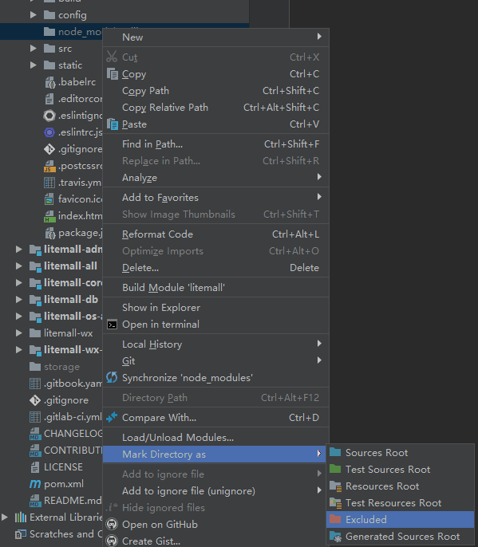

# 常见问题

## 1 小商城

这里主要是指litemall-wx-api、litemall-wx和renard-wx三个模块的相关问题。

### 1.1 小程序微信登录失败

现象：

小程序微信登录失败

原因：

小程序未上线之前，开发者必须设置自己申请的appid，否则微信登录肯定会失败。

解决：

1. 如果只是体验商品购买流程，开发者可以采用账号注册登录方式。
2. 开发者在litemall-wx、renard-wx和litemall-core模块的appid信息设置成自己申请的信息。

### 1.2 appid已经修改，微信登陆仍然失败

现象：

微信开发者工具修改了开发者自己申请的appid，后端也更新了相应信息，但是微信登录仍然报错。

原因：

这里可能是缓存问题，虽然修改了appid，但是微信开发者工具未及时更新。

解决：

微信开发者工具中修改appid以后，请关闭litemall-wx项目或者微信开发者工具，重新启动导入litemall-wx。

### 1.3 手机真机测试不正常

现象：

微信开发者工具打开正常，但是手机真机扫描加载小商场以后，只有页面结构，没有数据和图片。

原因：

数据或者图片不可访问。

解决：

1. 确保小商场后端服务可以访问，可以通过手机浏览器访问后端服务地址测试
   * 小商场的后端服务地址是localhost，则手机不可访问；
   * 小商场的后端服务地址是局域网地址，而手机不在局域网中（例如不是相同wifi，或者手机是移动网络）
   * 小商场的后端服务未启动
2. 手机小商场的**调试功能**开启

### 1.4 第三方手机测试不正常

现象：

开发者自己手机测试正常，而第三者手机测试不正常。

解决：

1. 确保小商场后端服务可以访问，可以通过第三者手机浏览器访问后端服务地址测试
2. 第三者手机小商场的**调试功能**开启
3. 在微信小程序平台设置第三者的微信账号是**体验者**

### 1.5 微信支付失败

现象：

小商场不能支付，或者点击支付总是报错

原因：

开发者必须拥有商户支付权限，然后设置好以下信息：
```
litemall.wx.app-id=
litemall.wx.app-secret=
litemall.wx.mch-id=
litemall.wx.mch-key=
litemall.wx.notify-url=
```

解决：

参考`3.0 小商场环境`，设置相应支付配置信息

### 1.6 支付成功，但商品仍未付款

现象：

在微信开发者工具中已经成功支付，但是返回订单页面时商品订单仍然显示`未付款`状态。

原因是：

微信平台支付成功以后，会把支付结果推送到`wx.notify-url`所指定的地址。
因此，开发者必须确定`wx.notify-url`所指向的访问链接是可以成功访问，同时
能够返回正常的响应结果。

解决：

1. 如果开发者是在微信开发者工具中测试支付，那么需要采用一些内网穿透工具，
把`WxOrderController.payNotify`所代表的本地地址，例如`http://localhots/wx/order/pay-notify`,
转换成外网可以访问的地址，例如`http://xxx.com/wx/order/pay-notify`，最后
设置`wx.notify-url`指向该地址。

2. 如果开发者已经上线服务，请确认`wx.notify-url`所指向的访问链接可以正常工作。

## 2. 管理后台

这里主要是指litemall-admin-api和litemall-admin两个模块的相关问题。

### 2.1 登录连接超时，联系管理员

现象：

管理后台登录时，出现报错信息：登录连接超时

原因：

1. 首先，需要明白这是前后端分离项目，前端会向后端发送请求；
2. 其次，需要明白报错的地方，是litemall-admin/src/utils/request.js文件中;
3. 最后，连接超时是说发送给后端的请求长时间未反应。这里存在两个可能性：
    * 真连接超时，目前request.js文件中设置请求超时时间是5s，因此真的可能5s后端
    未及时返回数据；
    * 假连接超时，例如向一个不存在的地址请求数据，那自然是返回连接失败。

解决：

通常是开发者设置不正确引起的假连接超时。

1. 首先，用chrome的开发者工具查看登录页面向后端请求的具体地址；
2. 然后，测试后端的服务是否已启动，请求地址是否可以访问。
3. 最后，如果设置正确，用chrome的开发者工具查看登录页面向后端请求返回数据信息；
如果设置不正确，请启动相应的后端服务。

## 3. 基础系统

这里主要是指litemall-db、litemall-core和litemall-all模块三个模块的相关问题。


### 3.1 Invalid bound statement

现象：

有时（特别是采用mybatis generator重新生成代码）后端服务报错

```
org.apache.ibatis.binding.BindingException: Invalid bound statement (not found): org.linlinjava.litemall.db.dao.XXXX
```

原因：

应该是自动生成的新的XML文件没有及时更新到编译文件夹target中，造成了target中mybatis的Java代码和XML文件不对应。

解决：

采用maven命令或者插件先清理项目再重新编译打包，例如
```bash
mvn clean
mvn package
```

### 3.2 Unknown Column

现象：

```
Error querying database. Cause: com.mysql.jdbc.exceptions.jdbc4.MySQLSyntaxErrorException: Unknown column 'add_time' in 'field list'
The error may exist in org/linlinjava/litemall/db/dao/LitemallSystemMapper.xml
The error may involve org.linlinjava.litemall.db.dao.LitemallSystemMapper.selectByExample-Inline
The error occurred while setting parameters
SQL: select id, key_name, key_value, add_time, update_time, deleted from litemall_system
Cause: com.mysql.jdbc.exceptions.jdbc4.MySQLSyntaxErrorException: Unknown column 'add_time' in 'field list'
```

原因：

系统处在开发中，所以数据库表根据业务会不断调整，因此如果开发者更新代码以后直接运行，有可能导致当前代码
操作数据库失败，因为开发者当前的数据库表已经过时。

解决：

如果出现数据库方面的报错，建议开发者重新导入数据库。

### 3.3 数据库导入失败

现象：

开发者直接（或使用Navicat）运行litemall_schema.sql时运行失败。

原因：

可能是`drop user if exists`在MySQL低版本不支持，也可能是Navicat不支持。

解决:

首先，请开发者请直接打开litemall_schema.sql文件，可以看到
```
drop database if exists litemall;
drop user if exists 'litemall'@'localhost';
create database litemall default character set utf8mb4 collate utf8mb4_unicode_ci;
use litemall;
create user 'litemall'@'localhost' identified by 'litemall123456';
grant all privileges on litemall.* to 'litemall'@'localhost';
flush privileges;
```

可以看到，这里主要是完成三个工作
* 创建数据库
* 创建数据库用户
* 分配该用户所有操作权限

因此，如果开发者运行litemall_schema.sql失败，开发者可以自行使用
相关SQL命令或者使用SQL工具创建数据库、用户和分配权限工作。

此外实际上，**开发者也不应该在部署或者上线阶段运行litemall_schema.sql**

## 4. 项目

这里主要是指其他项目开发相关问题。

### 4.1 项目导入IDEA时卡顿

现象：

IDEA导入项目时，非常耗时间，或者卡断，或者一直疯狂运行。

原因：

应该是litemall-admin模块的node_modules文件夹导致的。
node_modules是litemall-admin所依赖的项目库，可能有近200M的文件。
而IDEA如果没有设置，则可能尝试对该文件夹进行解析索引，从而导致卡断。

解决方案：

先关闭IDEA，然后删除node_modules文件夹，然后重新打开IDEA，设置node_modules文件夹Excluded状态。

    

### 4.2 项目war打包

目前不支持，请开发者自行实践。
