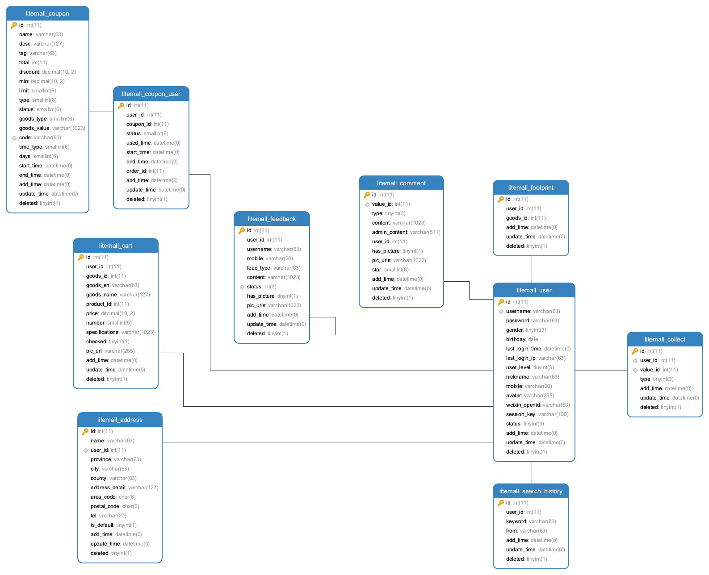
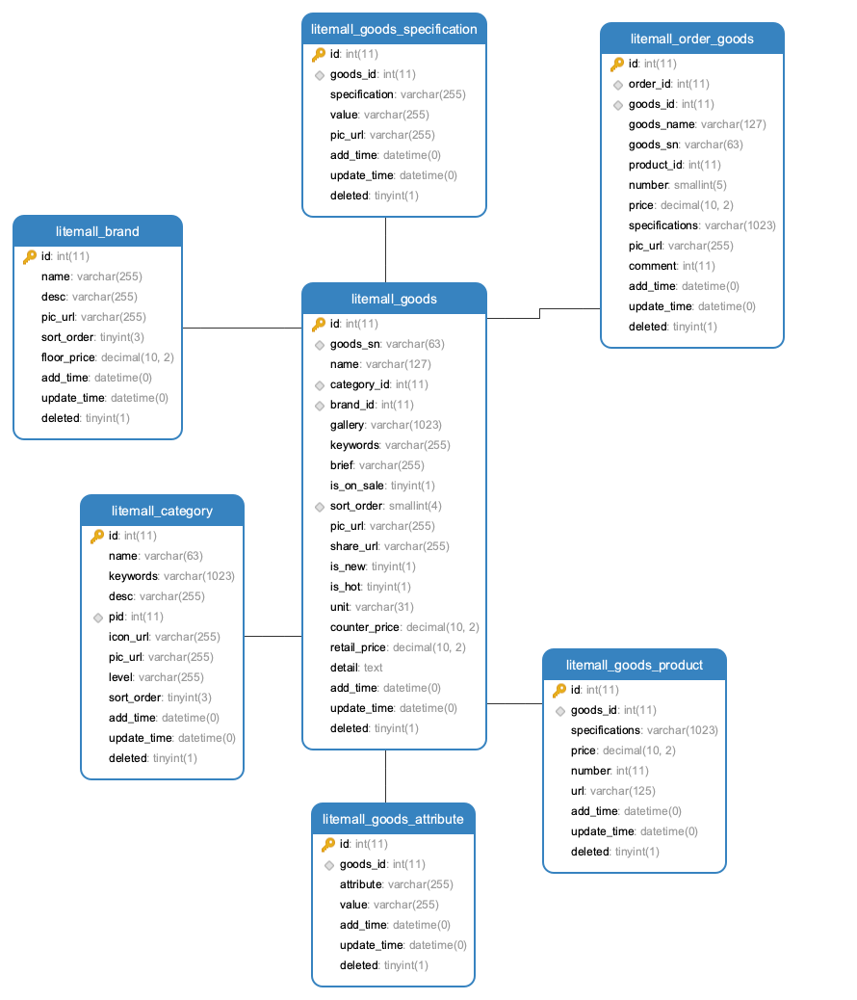
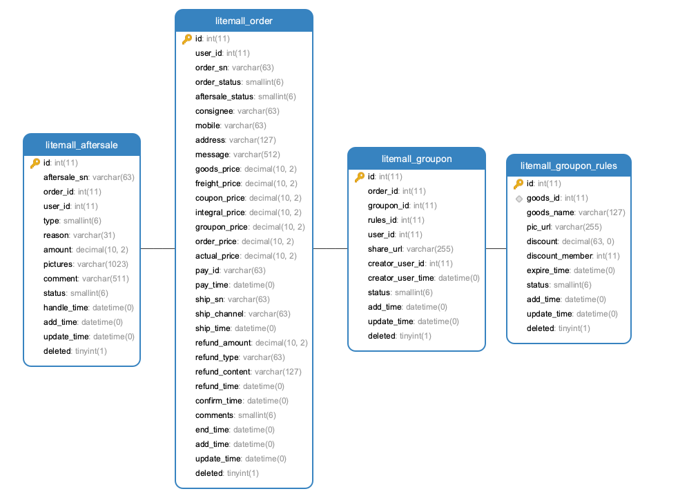
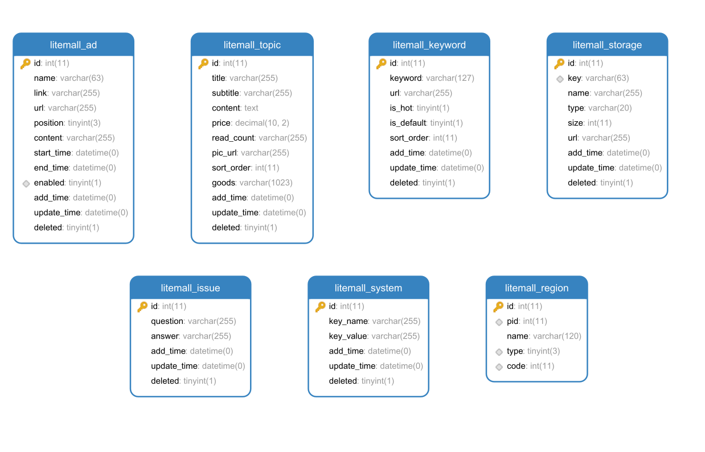
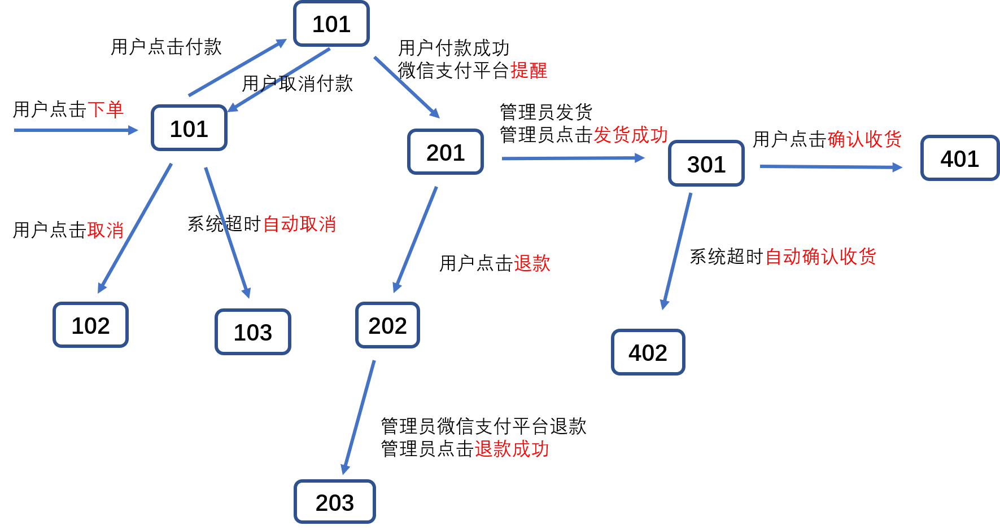

# 数据库

litemall数据库基于nideshop中的[nideshop.sql](https://github.com/tumobi/nideshop/blob/master/nideshop.sql)数据库，
然后在实际开发过程中进行了调整和修改:

* 删除了一些目前不必要的表；
* 删除了表中一些目前不必要的字段；
* 行政区域数据litemall_region没有采用原nideshop中的数据，而是采用了[Administrative-divisions-of-China](https://github.com/modood/Administrative-divisions-of-China)；
* 表中的某些字段采用JSON存储；
* 表中的日期或时间字段采用DATE、DATETIME；
* 字段的数据类型粗粒度化，例如避免MEDIUMINT，而是INT；
* 表的数据做了清理、调整和补充（假数据）。

litemall数据库由三个sql文件组成，在litemall-db文件夹下面的sql文件夹中：

1. litemall_schema.sql
  
   作用是创建空数据库、创建用户、设置访问权限。
   
   开发者开发测试阶段可以使用，但是部署生产阶段一定要注意修改这里的默认用户名和密码。

   注意，这里的sql文件不一定需要运行，开发者可以自己手动或命令行或IDE进行对应的操作即可。
   
2. litemall_table.sql

   作用是创建数据库表，但是没有创建任何数据。
   
   因此，开发者可以在部署生产阶段直接使用。
 
3. litemall_data.sql

   作用是创建测试数据。
      
   开发者开发测试阶段可以使用，但是部署开发阶段应该使用自己的数据。

综上，这里litemall真正必须运行的sql文件是litemall_table.sql，其他两个sql文件开发者自行决定如何是否使用。

## 1 数据表结构

### 1.1 用户相关

### 1.2 商品相关

### 1.3 订单相关

### 1.4 其他

## 2 数据表设计

接下来讨论一些数据表的关键细节。

### 2.1 商品和货品设计

这里商品存在商品表（litemall_goods)，商品属性表（litemall_goods_attribute），商品规格表（litemall_goods_specification），商品货品表（litemall_goods_product）四种表

商品表是一种商品的基本信息，主要包括商品介绍，商品图片，商品所属类目，商品品牌商等；

商品参数表其实也是商品的基本信息，但是由于是一对多关系，因此不能直接保存在商品表中（虽然采用JSON也可以但是不合理），
因此采用独立的商品参数表，通常是商品的一些公共基本商品参数；

商品规格表是商品进一步区分货品的标识，例如同样一款衣服，基本信息一致，基本属性一致，但是在尺寸这个属性上可以
把衣服区分成多个货品，而且造成对应的数量和价格不一致。商品规格可以看着是商品属性，但具有特殊特征。

商品规格和规格值存在以下几种关系：

* 单一规格和单一规格值，最常见的，即当前商品存在一种货品；
* 单一规格和多个规格值，较常见，即当前商品基于某个规格存在多种货品，通常价格都是相同的，当然也可能不相同；
* 多个规格和单一规格值，可以简化成第一种情况，或者采用第四种情况，通常实际情况下不常见；
* 多个规格和多个规格值，通常是两种规格或者三种规格较为常见，而且对应的价格不完全相同。

商品货品表则是最终实现商品库存管理、购买业务的实体对象，存在多个规格值、数量和价格。
例如，同样的衣服品牌，可能因为不能尺寸和颜色而存在最终的货品，这里每个货品的价格可以一样，也可以不一样。

总结一下，一个普通商品，实际上在数据库中，存在一个商品表项，存在（至少0个）多个商品属性表项目，存在（至少一个）多个商品规格表项，
存在（至少一个）多个货品表项。

举例如下：

* 一个商品“2018春季衣服商品编号1111111”，
* 存在两个商品参数，
  * 属性名称“面向人群”，属性值“男士”
  * 属性名称“面料”，属性值“100%棉”
* 存在两种规格（分别五个规格值和三个规格值）共八个商品规格项，
  * 规格名称“尺寸”，规则值“S”
  * 规格名称“尺寸”，规则值“M”
  * 规格名称“尺寸”，规则值“L”
  * 规格名称“尺寸”，规则值“XL”
  * 规格名称“尺寸”，规则值“XXL”
  * 规格名称“颜色”，规格值“蓝色”
  * 规格名称“颜色”，规格值“灰色”
  * 规格名称“颜色”，规格值“黑色”
* 存在15个货品（尺寸*颜色=15个货品)
  * 货品“S蓝”，数量 100， 价格 100
  * 货品“M蓝”，数量 100， 价格 100
  * 货品“L蓝”，数量 100， 价格 100
  * 货品“XL蓝”，数量 100， 价格 100
  * 货品“XXL蓝”，数量 100， 价格 100
  * 货品“S灰”，数量 100， 价格 100
  * 货品“M灰”，数量 100， 价格 100
  * 货品“L灰”，数量 100， 价格 100
  * 货品“XL灰”，数量 100， 价格 100
  * 货品“XXL灰”，数量 100， 价格 100
  * 货品“S黑”，数量 100， 价格 100
  * 货品“M黑”，数量 100， 价格 100
  * 货品“L黑”，数量 100， 价格 100
  * 货品“XL黑”，数量 0， 价格 100
  * 货品“XXL黑”，数量 0， 价格 100
  
以下是一些细节的讨论：

* 商品表中可能存在数量和价格属性，而货品中也存在数量和价格属性，目前设计这样：
  * 商品表的价格应该和某个货品的价格一样，通常应该是所有货品价格的最小值，或者基本款式的价格；
  * 商品表中的数量和价格应该仅用于展示，而不能用于最终的订单价格计算；
  * 商品表的数量应该设置成所有货品数量的总和；
  * 在管理后台添加商品时，如果管理员不填写商品表的数量和价格属性，则自动填写合适的值；如果填写，则使用显示。
  * 当小商城中，用户查看商品详情时，初始显示商品表的价格，而如果用户选择具体规格后，则商品
    详情里面的价格需要自动切换到该规格的价格。
* 商品规格可以存在规格图片，效果是规格名称前放置规格图片
* 货品也可以存在货品图片，效果是所有规格选定以后对应的货品有货，则在货品价格前放置货品图片
* 如果商品是两种规格，分别是M个和N个规格值，那么通常应该是`M*N`个货品，但是有些货品可能天然不存在。
  目前这里要求所有货品信息都应该存在，如果实际中货品不存在，也要设置商品数量为0.

注意：

> 这里的设计可能与实际项目设计不一致，但是目前是可行的。
> 商品的中文用语“商品”和英语用语“goods”，货品的中文用语“货品”和英语用语“product”可能是不正确的。

### 2.2 用户和微信用户设计

目前准备支持用户普通账号登录和微信登录两种方式，两种登录方式仅仅采用一个litemall-user表可能不是很合适。

外，如果进一步支持其他多种第三方登录，那么这里需要重新设计。

### 2.3 行政区域设计
 
litemall_region表保存了行政区域信息，包括省级、市级、县级三个等级，

原nideship.sql中存在region数据，但是litemall.sql的region数据则来自
[Administrative-divisions-of-China](https://github.com/modood/Administrative-divisions-of-China)项目。

### 2.4 订单设计

订单信息主要由基本信息、商品信息、地址信息、费用信息、快递信息、支付信息和其他信息组成，
由litemall_order表和litemall_order_goods表保存。

* 基本信息

订单创建时的一些基本信息，例如用户、订单状态和订单留言等。
其中订单状态是最重要的信息。

* 商品信息

由于订单可以存在多个商品，因此订单的商品信息是由独立的订单商品表记录（可能更应该称为货品）。

* 费用信息

订单一些费用情况，例如商品总价、优惠减免和实际付费等。

* 收货信息

用户下单时选择的收货地址以及联系人信息。

* 快递信息

目前快递信息仅仅记录快递公司、快递单号、快递发出时间。
而如果快递过程中如果存在一些异常，例如物品丢失，则目前系统难以处理。

* 支付信息

支付时间和支付订单ID。

* 评论信息

订单商品的评论情况。

* 其他信息

#### 2.4.1 订单状态

订单分成几种基本的状态：

* 101

  状态码101，此时订单生成，记录订单编号、收货地址信息、订单商品信息和订单相关费用信息；

* 201

  状态码201，此时用户微信支付付款，系统记录微信支付订单号、支付时间、支付状态；

* 301

  状态码301，此时商场已经发货，系统记录快递公司、快递单号、快递发送时间。
  当快递公司反馈用户签收后，系统记录快递到达时间。

* 401

  状态码401，当用户收到货以后点击确认收货，系统记录确认时间。

以上是一个订单成功完成的基本流程，但实际中还存在其他情况。

* 102

  状态码102，用户下单后未付款之前，点击取消按钮，系统记录结束时间

* 103

  状态码103，用户下单后半小时未付款则系统自动取消，系统记录结束时间

* 202

  状态码202，用户付款以后未发货前，点击退款按钮，系统进行设置退款状态，等待管理员退款操作

* 203

  状态码203，管理员在管理后台看到用户的退款申请，点击退款按钮进行退款操作。
  
* 402

  状态码402，用户已签收却不点击确认收货，超期7天以后，则系统自动确认收货。
  用户不能再点击确认收货按钮，但是可以评价订单商品。

此外，当订单状态码是102、103、203、401和402时，订单可以执行删除操作。
目前的设计是不执行物理删除，而是逻辑删除，因此用户查看自己订单时将看不到这些“已删除”的订单。

注意：
> 在上图中可以看到`101`到`101`的状态变化，这里只是小商场用户的操作，不会影响订单状态码。
> 如果用户点击付款时，后端服务会生成预支付会话id，但是不会影响订单状态。
> 如果而用户支付过程中，放弃支付，则也不会影响订单状态。

#### 2.4.2 状态变化

* 初始 -> 101

小商场用户在小商场点击`下单`按钮，此时小商城后端服务会生产商户订单。

所对应的后台服务方法是litemall-wx-api模块的`WxOrderController.submit`方法。
 
* 101 -> 101

这里开发者可能会奇怪，这里存在101->101的变化，这里表明后台没有响应
小程序端的请求，但是这里的响应没有导致订单状态实际的变化。这里所指的
响应小程序端请求是指下单成功以后小程序端自动请求付款或者用户在订单页面中
点击`付款`所导致的对后台服务的预支付请求。

关于微信支付流程，可以参看官方文档的[小程序支付业务流程](https://pay.weixin.qq.com/wiki/doc/api/wxa/wxa_api.php?chapter=7_4&index=3)
也就是说这里小商城后台服务会返回付支付信息。

所对应的后台服务方法是litemall-wx-api模块的`WxOrderController.prepay`

小商城接收返回的预支付信息后，会在小程序端出现支付页面。
如果用户放弃支付，则不会出现任何效果，不会向小商场后台服务发送任何信息。
如果用户支付，则会导致微信商户平台向小商场后台服务推送支付结果。

* 101 -> 102

如果用户没有支付，那么此时用户可以点击`取消订单`按钮来放弃当前订单。

所对应的后台服务方法是litemall-wx-api模块的`WxOrderController.cancel`

* 101 -> 103

如果用户没有支付，也没有点击`取消订单`按钮，那么系统会定时查询数据库的订单信息。
如果发现存在订单未支付状态超时半小时，此时系统会自动取消订单，来释放商品资源。

对应的应该是litemall-admin-api模块的系统定时任务的`OrderJob.checkOrderUnpaid`

* 101 -> 201

如果用户支付，微信商户平台会向小商场后台服务推送支付结果。
而响应结果表示支付成功，则订单状态信息设置201，表示支付成功。

所对应的后台服务方法是litemall-wx-api模块的`WxOrderController.payNotify`

* 201 -> 202

当用户支付以后，管理员未发货前，用户可以点击`退款`申请退款取消订单。
通常用户点击退款以后系统可以基于微信商户平台的退款接口实现自动退款，
但是这里考虑到安全原因，不支持系统自动退款操作。
相应地，这里小商场后台服务只是设置订单状态，表示退款申请中。

所对应的后台服务方法是litemall-wx-api模块的`WxOrderController.refund`

* 202 -> 203

这里退款操作是由管理员在微信商户平台手动退款，然后在本项目的
管理平台里面点击`退款确认`按钮，此时订单状态会设置成203，表明
退款已经成功，同时系统会自动恢复订单商品数量。

所对应的后台服务方法是litemall-admin-api模块的`AdminOrderController.refundConfirm`

* 201 -> 301

当订单支付以后，管理员进行订单发货，然后在管理平台点击`发货`，填写快递信息，
设置订单状态是301，表示管理员已发货状态。

所对应的后台服务方法是litemall-admin-api模块的`AdminOrderController.ship`

* 301 -> 401

当用户收到商品以后，用户点击`收货确认`按钮，设置订单状态401，表示用户成功收货。

所对应的后台服务方法是litemall-wx-api模块的`WxOrderController.confirm`

* 301 -> 402

当管理员发货以后，用户一直没有确认收货，系统定时检测订单状态，如果发现发货以后
七天用户都没有收货，此时系统自动确认用户收货，设置订单状态402。

应该改为 litemall-admin-api模块的系统定时任务`OrderJob.checkOrderUnconfirm`

注意：
> 上述订单状态变化中具体的逻辑处理可以参考相应模块文档和模块代码。

#### 2.4.2 用户操作

订单状态码标识了订单的状态，但是对于用户而言，真正关心的只是他们能够进行的操作，
也就是在小商场的小程序端用户可以进行点击的按钮操作，目前支持：

* `支付`，如果下单后未立即支付，则订单详情页面会出现`支付`按钮；
* `取消`，如果用户未支付，则订单详情页面会出现`取消`按钮；
* `退款`，如果用户支付后但是管理员未发货，则订单详情页面会出现`退款`按钮；
* `确认收货`，如果管理员已发货，则订单详情页面会出现`确认收货`按钮；
* `申请退货`，如果用户已经确认收货同时未超过一段时间，则订单详情页面会出现`申请退货`按钮；
   注意，这里如果是系统超时自动确认收货，则不会出现；
* `去评价`，如果用户确认收货以后，则订单详情页面会出现`去评价`按钮；
* `再次购买`，如果用户确认收货以后，则订单详情页面会出现`再次购买`按钮；
* `删除`，如果当前订单状态码是102、103、203、401和402时，则订单详情页面会出现`删除订单`按钮；
   注意，这里的删除操作是逻辑删除，即设置订单的删除状态`deleted`。
  
因此订单状态码和小商场用户操作之间存在映射关系：

* 101

  用户可以`支付`、`取消`

* 102

  用户可以`删除`

* 103

  用户可以`删除`

* 201

  用户可以`退款`

* 203

  用户可以`删除`

* 301

  用户可以`确认收货`

* 401

  用户可以`删除`、`去评价`、`申请售后`、`再次购买`

* 402

  用户可以`删除`、`去评价`、`申请售后`、`再次购买`

#### 2.4.3 申请售后

当用户确认收货或者系统自动确认收货以后，订单可以申请售后。
目前仅支持订单整体售后，而不支持订单商品独立售后。
这是因为：订单存在商品售价、优惠券减免、团购减免以及物流运费属性，
如果要支持单个商品退款，那么存在一个需要解决的问题就是单个商品的
退款金额如何计算。如果开发者这里考虑清楚，也可以参考当前代码实现
订单商品独立售后

litemall_order表中存在`aftersale_status`字段，记录订单售后状态。
而具体的售后记录则是litemall_aftersale表记录。

这里`type`字段表示当前售后类型，目前存在三种类型：

* 如果type=0，即“未收货退款”，通常是系统超时自动确认收货，而实际上用户没有收货，因此可以选择这个；
* 如果type=1，即“无需退货退款”，通常是用户确认收货后申请售后，而管理员同意可以不需要退货，直接退款给用户；
* 如果type=2，即“退货退款”，通常是用户确认收货后申请售后，管理员同意用户退货，当管理员收到货以后再退款给用户。

需要注意的是：当前实现中，如果是“退货退款”类型，那么管理员在进行退款以后，系统会自动恢复货品数量。
这是因为管理员完成“退货退款”售后，说明管理员已经收到用户的退货。
开发者可以改变这里的实现逻辑，例如采用独立的退货入库流程。

`status`字段表示当前售后状态，分别是：

* 如果status=0，未申请售后；
* 如果status=1，用户申请售后，等待管理员审核；
* 如果status=2，管理员审核通过，等待管理员退款；
* 如果status=3，管理员已退款，售后完成；
* 如果status=4，管理员审核不通过，售后完成；
* 如果status=5，用户已取消售后，当用户在申请售后以后可以在管理员审核前申请取消。

这里需要补充的是：订单litemall_order表的`aftersale_status`字段，和订单售后litemall_aftersale
表的`status`字段是完全一致的，方便前端分别查询订单状态和订单售后状态。

`amount`字段表示当前售后退款金额，正如前面所述当前仅支持订单整体售后，因此目前设计的退款金额是
订单实际付款-订单运费。

#### 2.4.4 商品评价

在litemall_order表中存在`comments`字段，表示有几个订单商品没有评价；
而在litemall_order_goods表中存在`comment`字段，表示当前订单商品的评论ID。

* 当用户确认收货以后，`comments`设置当前订单中未评价的商品数量。而`comment`设置0；
* 当用户评价一个订单商品，`comments`会减一，而`comment`指向新创建的评论；
* 如果用户不评论超期，`comments`会设置0，而`comment`设置-1;

### 2.5 评论设计

评论表litemall_comment保存评论相关的信息，其中最关键的是`type`字段和`value_id`字段。

这里`type`字段表示当前评论类型，目前存在两种类型：

* 如果type=0，则当前评论是订单商品评论，value_id是订单商品ID；
* 如果type=1，则当前评论是专题评论，value_id是专题ID；

`admin_content`字段则拥有记录管理后台管理员对用户评论的回复。

### 2.6 团购设计

团购是由团购规则表litemall_groupon_rules和团购活动表litemall_groupon组成。

管理员在管理后台对一些商品配置团购规则，保存在litemall_groupon_rules表中。

用户在小商场中则看到团购规则给出的优惠信息。
接下来用户存在两种操作：
第一种是，用户开团，保存在litemall_groupon中，用户主动分享商品团购页面给朋友；
第二张是，用户参团，也保存在litemall_groupon中。

只有开团人数符合团购规则条件，创建的订单才会有效，否则管理员需要退款取消当前团购。

### 2.7 优惠券设计

优惠券由litemall_coupon表和litemall_coupon_user表组成：
* litemall_coupon表，是优惠券基本信息及使用规则。
* litemall_coupon_user表，是用户优惠券领取和使用的记录。

#### 2.7.1 type

type字段，标识优惠券发送的方式，目前支持：
* 通用券，即在首页或者优惠券列表页，用户可以看到优惠券信息并且点击领取；
* 注册券，即用户注册成功以后即系统自动发送给用户，无需领取；
* 兑换券，即用户在个人优惠券页面输入兑换码来兑换一张优惠券。

#### 2.7.2 goods_type

goods_type字段，标识优惠券所能使用的商品范围：
* 全场通用，即所有商品都能使用；
* 类目限制，**目前不支持**，即某个类目的商品才能使用；
* 商品限制，**目前不支持**，即部分商品才能使用优惠券。

#### 2.7.3 time_type

time_type字段，标识优惠券有效期；
* 用户领券日期的相对天数，即用户领券以后开始几天内有效；
* 管理员设置的绝对时间，即优惠券的开始使用时间和截至使用时间。

#### 2.7.4 status

status字段，标识优惠券的当前状态。

这里需要指出的是，litemall_coupon表和litemall_coupon_user表都有status字段。

litemall_coupon表的status字段，包含以后三种状态：
* 正常可用，
* 已过期，
* 已下架，

litemall_coupon_user表的status字段，包含以后三种状态：
* 未使用，
* 已使用，
* 已过期，
* 已下架，

### 2.8 系统配置设计

系统配置表litemall_system保存系统的配置信息。

这里需要注意的是，在Java代码层系统配置表只能执行更新操作，
不能执行创建和删除操作。也就是说，系统配置数据都应该是开发者
基于系统的配置需求在数据库中手动创建。

### 2.9 存储对象设计

存储对象表litemall_storage保存上传文件信息。

当用户或者管理员上传图像时，图像文件会保存到本地或者第三方云存储服务器中，
同时在存储对象表中记录一下。

### 2.10 操作日志设计

业务日志表litemall_log记录管理员的关键性操作。

需要讨论的是，很多项目的业务日志模块采用注解方式，即加上方法注解，因此可以自动捕获
用户的操作行为。虽然这样做很方便且不会影响业务代码，但是实际上最终是粗颗粒地记录，反而记录意义不大。

因此本项目采用在方法内手写业务日志代码方式记录业务操作行为及结果。
虽然比较繁琐，但是可以保证记录是细颗粒的。而且，如果管理员最终关心的操作较少，那么
实际上需要写的代码不是很多。

考虑到语义，操作业务应该是“谁做了什么操作，结果成功还是失败，失败原因是什么，补充信息是什么”，
因此这里设计的业务日志表关键字段如下：
* 管理员
* IP地址
* 操作分类
* 操作动作
* 操作状态
* 操作结果
* 补充信息

#### 2.10.1 操作类别

这里的日志类型设计成四种（当然开发者需要可以扩展）
* 一般日志：用户觉得需要查看的一般操作日志，建议是默认的日志级别
* 安全日志：用户安全相关的操作日志，例如登录、删除管理员
* 订单日志：用户交易相关的操作日志，例如订单发货、退款
* 其他日志：如果以上三种不合适，可以选择其他日志，建议是优先级最低的日志级别

当然建议开发者应该和最终用户讨论交流，记录真正关键性的业务操作，例如登录相关或订单相关等。

#### 2.10.2 操作结果

如果操作成功，可以使用操作结果字段记录被操作的对象。
当然，有些操作没有具体对象，那么可以省略。

如果操作失败，也可以使用操作结果字段记录失败的原因。

#### 2.10.3 操作失败

虽然这里有操作状态字段和操作结果字段，可以记录操作失败的状态。
但是通常失败操作不会对系统或者数据库带来影响，因此实际上开发者其实不需要
记录太多操作失败的日志，而是记录操作成功的日志，告诉系统管理员当前状态的变化。

当然，是否记录操作失败取决于开发者或者最终用户是否需要。
例如，登录这里应该记录用户登录失败的日志，因为保存的IP地址可以帮助管理员了解
系统被访问的情况。

### 2.11 通用设计

除了以上表，数据库还存在其他一些业务表，例如专题表litemall_topic，
但是都很直观，不需要多讨论。

以下是一些表设计中无具体业务意义可通用的字段。

#### 2.11.1 deleted

除极少数表，其他所有表都存在`deleted`字段，支持逻辑删除。
因此目前删除数据时，不会直接删除数据，而是修改`deleted`字段。
当然，数据库管理员可以连接到数据库直接删除数据，或者开发者
可以修改这里的逻辑采用物理删除。

#### 2.11.2 add_time

除极少数表，其他所有表都存在`add_time`字段，记录数据创建时间。

#### 2.11.3 update_time

除极少数表，其他所有表都存在`update_time`字段，记录数据修改时间。

此外，此外开发者可以利用update_time来实现乐观锁更新机制。