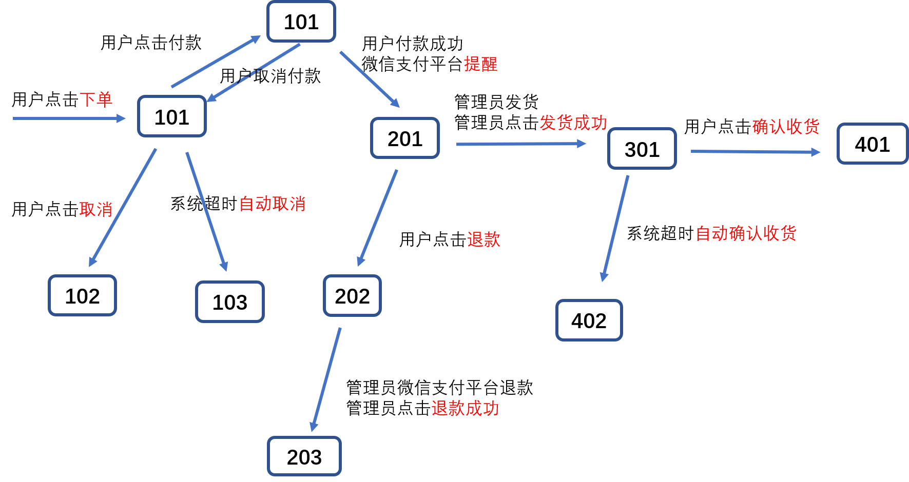

# 2 litemall基础系统

目前litemall基础系统由以下部分组成：

* litemall数据库
* litemall-core模块
* litemall-db模块
* litemall-all模块

litemall-db模块提供数据库访问服务。

litemall-core模块提供通用服务。

litemall-all模块则只是一个包裹模块，几乎没有任何代码。该模块的作用是融合两个spring boot模块
和litemall-admin模块静态文件到一个单独Spring Boot可执行jar包中。

## 2.1 litemall数据库

litemall数据库基于nideshop中的[nideshop.sql](https://github.com/tumobi/nideshop/blob/master/nideshop.sql)数据库，然后在实际开发过程中进行了调整和修改:

* 删除了一些目前不必要的表；
* 删除了表中一些目前不必要的字段；
* 行政区域数据litemall_region没有采用原nideshop中的数据，而是采用了[Administrative-divisions-of-China](https://github.com/modood/Administrative-divisions-of-China)；
* 表中的某些字段采用JSON存储；
* 表中的日期或时间字段采用DATE、DATETIME；
* 字段的数据类型粗粒度化，例如避免MEDIUMINT，而是INT；
* 表的数据做了清理、调整和补充（假数据）。

litemall数据库由三个sql文件组成，在litemall-db文件夹下面的sql文件夹中：

1. litemall_schema.sql
  
   作用是创建空数据库、创建用户、设置访问权限。
   
   开发者开发测试阶段可以使用，但是部署生产阶段一定要注意修改这里的默认用户名和密码。

   注意，这里的sql文件不一定需要运行，开发者可以自己手动或命令行或IDE进行对应的操作即可。
   
2. litemall_table.sql

   作用是创建数据库表，但是没有创建任何数据。
   
   因此，开发者可以在部署生产阶段直接使用。
 
3. litemall_data.sql

   作用是创建测试数据。
      
   开发者开发测试阶段可以使用，但是部署开发阶段应该使用自己的数据。

综上，这里litemall真正必须运行的sql文件是litemall_table.sql，其他两个sql文件开发者自行决定如何是否使用。

以下讨论一些关键性设计

注意：
> 以下设计基于个人理解，很可能存在不合理或者与实际系统不符合的地方。

### 2.1.1 商品和货品设计

这里商品存在商品表（litemall_goods)，商品属性表（litemall_goods_attribute），商品规格表（litemall_goods_specification），商品货品表（litemall_goods_product）四种表

商品表是一种商品的基本信息，主要包括商品介绍，商品图片，商品所属类目，商品品牌商等；

商品参数表其实也是商品的基本信息，但是由于是一对多关系，因此不能直接保存在商品表中（虽然采用JSON也可以但是不合理），
因此采用独立的商品参数表，通常是商品的一些公共基本商品参数；

商品规格表是商品进一步区分货品的标识，例如同样一款衣服，基本信息一致，基本属性一致，但是在尺寸这个属性上可以
把衣服区分成多个货品，而且造成对应的数量和价格不一致。商品规格可以看着是商品属性，但具有特殊特征。

商品规格和规格值存在以下几种关系：

* 单一规格和单一规格值，最常见的，即当前商品存在一种货品；
* 单一规格和多个规格值，较常见，即当前商品基于某个规格存在多种货品，通常价格都是相同的，当然也可能不相同；
* 多个规格和单一规格值，可以简化成第一种情况，或者采用第四种情况，通常实际情况下不常见；
* 多个规格和多个规格值，通常是两种规格或者三种规格较为常见，而且对应的价格不完全相同。

商品货品表则是最终实现商品库存管理、购买业务的实体对象，存在多个规格值、数量和价格。
例如，同样的衣服品牌，可能因为不能尺寸和颜色而存在最终的货品，这里每个货品的价格可以一样，也可以不一样。

总结一下，一个普通商品，实际上在数据库中，存在一个商品表项，存在（至少0个）多个商品属性表项目，存在（至少一个）多个商品规格表项，
存在（至少一个）多个货品表项。

举例如下：

* 一个商品“2018春季衣服商品编号1111111”，
* 存在两个商品参数，
  * 属性名称“面向人群”，属性值“男士”
  * 属性名称“面料”，属性值“100%棉”
* 存在两种规格（分别五个规格值和三个规格值）共八个商品规格项，
  * 规格名称“尺寸”，规则值“S”
  * 规格名称“尺寸”，规则值“M”
  * 规格名称“尺寸”，规则值“L”
  * 规格名称“尺寸”，规则值“XL”
  * 规格名称“尺寸”，规则值“XXL”
  * 规格名称“颜色”，规格值“蓝色”
  * 规格名称“颜色”，规格值“灰色”
  * 规格名称“颜色”，规格值“黑色”
* 存在15个货品（尺寸*颜色=15个货品)
  * 货品“S蓝”，数量 100， 价格 100
  * 货品“M蓝”，数量 100， 价格 100
  * 货品“L蓝”，数量 100， 价格 100
  * 货品“XL蓝”，数量 100， 价格 100
  * 货品“XXL蓝”，数量 100， 价格 100
  * 货品“S灰”，数量 100， 价格 100
  * 货品“M灰”，数量 100， 价格 100
  * 货品“L灰”，数量 100， 价格 100
  * 货品“XL灰”，数量 100， 价格 100
  * 货品“XXL灰”，数量 100， 价格 100
  * 货品“S黑”，数量 100， 价格 100
  * 货品“M黑”，数量 100， 价格 100
  * 货品“L黑”，数量 100， 价格 100
  * 货品“XL黑”，数量 0， 价格 100
  * 货品“XXL黑”，数量 0， 价格 100
  
以下是一些细节的讨论：

* 商品表中可能存在数量和价格属性，而货品中也存在数量和价格属性，目前设计这样：
  * 商品表的价格应该和某个货品的价格一样，通常应该是所有货品价格的最小值，或者基本款式的价格；
  * 商品表中的数量和价格应该仅用于展示，而不能用于最终的订单价格计算；
  * 商品表的数量应该设置成所有货品数量的总和；
  * 在管理后台添加商品时，如果管理员不填写商品表的数量和价格属性，则自动填写合适的值；如果填写，则使用显示。
  * 当小商城中，用户查看商品详情时，初始显示商品表的价格，而如果用户选择具体规格后，则商品
    详情里面的价格需要自动切换到该规格的价格。
* 商品规格可以存在规格图片，效果是规格名称前放置规格图片
* 货品也可以存在货品图片，效果是所有规格选定以后对应的货品有货，则在货品价格前放置货品图片
* 如果商品是两种规格，分别是M个和N个规格值，那么通常应该是`M*N`个货品，但是有些货品可能天然不存在。
  目前这里要求所有货品信息都应该存在，如果实际中货品不存在，也要设置商品数量为0.

注意：

> 这里的设计可能与实际项目设计不一致，但是目前是可行的。
> 商品的中文用语“商品”和英语用语“goods”，货品的中文用语“货品”和英语用语“product”可能是不正确的。

### 2.1.2 用户和微信用户设计

目前准备支持用户普通账号登录和微信登录两种方式，两种登录方式仅仅采用一个litemall-user表可能不是很合适。

外，如果进一步支持其他多种第三方登录，那么这里需要重新设计。

### 2.1.3 行政区域设计
 
litemall_region表保存了行政区域信息，包括省级、市级、县级三个等级，

原nideship.sql中存在region数据，但是litemall.sql的region数据则来自
[Administrative-divisions-of-China](https://github.com/modood/Administrative-divisions-of-China)项目。

### 2.1.4 订单设计

订单信息主要由基本信息、商品信息、地址信息、费用信息、快递信息、支付信息和其他信息组成，
由litemall_order表和litemall_order_goods表保存。

* 基本信息

订单创建时的一些基本信息，例如用户、订单状态和订单留言等。
其中订单状态是最重要的信息。

* 商品信息

由于订单可以存在多个商品，因此订单的商品信息是由独立的订单商品表记录（可能更应该称为货品）。

* 费用信息

订单一些费用情况，例如商品总价、优惠减免和实际付费等。

* 收货信息

用户下单时选择的收货地址以及联系人信息。

* 快递信息

目前快递信息仅仅记录快递公司、快递单号、快递发出时间。
而如果快递过程中如果存在一些异常，例如物品丢失，则目前系统难以处理。

* 支付信息

支付时间和支付订单ID。

* 评论信息

订单商品的评论情况。

* 其他信息

#### 2.1.4.1 订单状态



订单分成几种基本的状态：

* 101

  状态码101，此时订单生成，记录订单编号、收货地址信息、订单商品信息和订单相关费用信息；

* 201

  状态码201，此时用户微信支付付款，系统记录微信支付订单号、支付时间、支付状态；

* 301

  状态码301，此时商场已经发货，系统记录快递公司、快递单号、快递发送时间。
  当快递公司反馈用户签收后，系统记录快递到达时间。

* 401

  状态码401，当用户收到货以后点击确认收货，系统记录确认时间。

以上是一个订单成功完成的基本流程，但实际中还存在其他情况。

* 102

  状态码102，用户下单后未付款之前，点击取消按钮，系统记录结束时间

* 103

  状态码103，用户下单后半小时未付款则系统自动取消，系统记录结束时间

* 202

  状态码202，用户付款以后未发货前，点击退款按钮，系统进行设置退款状态，等待管理员退款操作

* 203

  状态码203，管理员在管理后台看到用户的退款申请，点击退款按钮进行退款操作。
  
* 402

  状态码402，用户已签收却不点击确认收货，超期7天以后，则系统自动确认收货。
  用户不能再点击确认收货按钮，但是可以评价订单商品。

此外，当订单状态码是102、103、203、401和402时，订单可以执行删除操作。
目前的设计是不执行物理删除，而是逻辑删除，因此用户查看自己订单时将看不到这些“已删除”的订单。

注意：
> 在上图中可以看到`101`到`101`的状态变化，这里只是小商场用户的操作，不会影响订单状态码。
> 如果用户点击付款时，后端服务会生成预支付会话id，但是不会影响订单状态。
> 如果而用户支付过程中，放弃支付，则也不会影响订单状态。

#### 2.1.4.2 状态变化

* 初始 -> 101

小商场用户在小商场点击`下单`按钮，此时小商城后端服务会生产商户订单。

所对应的后台服务方法是litemall-wx-api模块的`WxOrderController.submit`方法。
 
* 101 -> 101

这里开发者可能会奇怪，这里存在101->101的变化，这里表明后台没有响应
小程序端的请求，但是这里的响应没有导致订单状态实际的变化。这里所指的
响应小程序端请求是指下单成功以后小程序端自动请求付款或者用户在订单页面中
点击`付款`所导致的对后台服务的预支付请求。

关于微信支付流程，可以参看官方文档的[小程序支付业务流程](https://pay.weixin.qq.com/wiki/doc/api/wxa/wxa_api.php?chapter=7_4&index=3)
也就是说这里小商城后台服务会返回付支付信息。

所对应的后台服务方法是litemall-wx-api模块的`WxOrderController.prepay`

小商城接收返回的预支付信息后，会在小程序端出现支付页面。
如果用户放弃支付，则不会出现任何效果，不会向小商场后台服务发送任何信息。
如果用户支付，则会导致微信商户平台向小商场后台服务推送支付结果。

* 101 -> 102

如果用户没有支付，那么此时用户可以点击`取消订单`按钮来放弃当前订单。

所对应的后台服务方法是litemall-wx-api模块的`WxOrderController.cancel`

* 101 -> 103

如果用户没有支付，也没有点击`取消订单`按钮，那么系统会定时查询数据库的订单信息。
如果发现存在订单未支付状态超时半小时，此时系统会自动取消订单，来释放商品资源。

所对应的后台服务方法是litemall-admin-api模块的`AdminOrderController.checkOrderUnpaid`

* 101 -> 201

如果用户支付，微信商户平台会向小商场后台服务推送支付结果。
而响应结果表示支付成功，则订单状态信息设置201，表示支付成功。

所对应的后台服务方法是litemall-wx-api模块的`WxOrderController.payNotify`

* 201 -> 202

当用户支付以后，管理员未发货前，用户可以点击`退款`申请退款取消订单。
通常用户点击退款以后系统可以基于微信商户平台的退款接口实现自动退款，
但是这里考虑到安全原因，不支持系统自动退款操作。
相应地，这里小商场后台服务只是设置订单状态，表示退款申请中。

所对应的后台服务方法是litemall-wx-api模块的`WxOrderController.refund`

* 202 -> 203

这里退款操作是由管理员在微信商户平台手动退款，然后在本项目的
管理平台里面点击`退款确认`按钮，此时订单状态会设置成203，表明
退款已经成功，同时系统会自动恢复订单商品数量。

所对应的后台服务方法是litemall-admin-api模块的`AdminOrderController.refundConfirm`

* 201 -> 301

当订单支付以后，管理员进行订单发货，然后在管理平台点击`发货`，填写快递信息，
设置订单状态是301，表示管理员已发货状态。

所对应的后台服务方法是litemall-admin-api模块的`AdminOrderController.ship`

* 301 -> 401

当用户收到商品以后，用户点击`收货确认`按钮，设置订单状态401，表示用户成功收货。

所对应的后台服务方法是litemall-wx-api模块的`WxOrderController.confirm`

* 301 -> 402

当管理员发货以后，用户一直没有确认收货，系统定时检测订单状态，如果发现发货以后
七天用户都没有收货，此时系统自动确认用户收货，设置订单状态402。

所对应的后台服务方法是litemall-admin-api模块的`AdminOrderController.checkOrderUnpaid`

注意：
> 上述订单状态变化中具体的逻辑处理可以参考相应模块文档和模块代码。

#### 2.1.4.2 用户操作

订单状态码标识了订单的状态，但是对于用户而言，真正关心的只是他们能够进行的操作，
也就是在小商场的小程序端用户可以进行点击的按钮操作，目前支持：

* `支付`，如果下单后未立即支付，则订单详情页面会出现`支付`按钮；
* `取消`，如果用户未支付，则订单详情页面会出现`取消`按钮；
* `退款`，如果用户支付后但是管理员未发货，则订单详情页面会出现`退款`按钮；
* `确认收货`，如果管理员已发货，则订单详情页面会出现`确认收货`按钮；
* `申请退货`，如果用户已经确认收货同时未超过一段时间，则订单详情页面会出现`申请退货`按钮；
   注意，这里如果是系统超时自动确认收货，则不会出现；
* `去评价`，如果用户确认收货以后，则订单详情页面会出现`去评价`按钮；
* `再次购买`，如果用户确认收货以后，则订单详情页面会出现`再次购买`按钮；
* `删除`，如果当前订单状态码是102、103、203、401和402时，则订单详情页面会出现`删除订单`按钮；
   注意，这里的删除操作是逻辑删除，即设置订单的删除状态`deleted`。
  
因此订单状态码和小商场用户操作之间存在映射关系：

* 101

  用户可以`支付`、`取消`

* 102

  用户可以`删除`

* 103

  用户可以`删除`

* 201

  用户可以`退款`

* 203

  用户可以`删除`

* 301

  用户可以`确认收货`

* 401

  用户可以`删除`、`去评价`、`再次购买`

* 402

  用户可以`删除`、`去评价`、`再次购买`

#### 2.1.4.3 售后处理

目前不支持退货售后相关业务。

#### 2.1.4.4 商品评价

在litemall_order表中存在`comments`字段，表示有几个订单商品没有评价；
而在litemall_order_goods表中存在`comment`字段，表示当前订单商品的评论ID。

* 当用户确认收货以后，`comments`设置当前订单中未评价的商品数量。而`comment`设置0；
* 当用户评价一个订单商品，`comments`会减一，而`comment`指向新创建的评论；
* 如果用户不评论超期，`comments`会设置0，而`comment`设置-1;

### 2.1.5 评论设计

评论表litemall_comment保存评论相关的信息，其中最关键的是`type`字段和`value_id`字段。

这里`type`字段表示当前评论类型，目前存在三种类型：

* 如果type=0，则当前评论是订单商品评论，value_id是订单商品ID；
* 如果type=1，则当前评论是专题评论，value_id是专题ID；
* 如果type=2，则当前评论是订单商品评论的回复，value_id是订单商品的评论ID。

### 2.1.6 团购设计

团购是由团购规则表litemall_groupon_rules和团购活动表litemall_groupon组成。

管理员在管理后台对一些商品配置团购规则，保存在litemall_groupon_rules表中。

用户在小商场中则看到团购规则给出的优惠信息。
接下来用户存在两种操作：
第一种是，用户开团，保存在litemall_groupon中，用户主动分享商品团购页面给朋友；
第二张是，用户参团，也保存在litemall_groupon中。

只有开团人数符合团购规则条件，创建的订单才会有效，否则管理员需要退款取消当前团购。

### 2.1.7 优惠券设计

优惠券由litemall_coupon表和litemall_coupon_user表组成：
* litemall_coupon表，是优惠券基本信息及使用规则。
* litemall_coupon_user表，是用户优惠券领取和使用的记录。

#### 2.1.7.1 type

type字段，标识优惠券发送的方式，目前支持：
* 通用券，即在首页或者优惠券列表页，用户可以看到优惠券信息并且点击领取；
* 注册券，即用户注册成功以后即系统自动发送给用户，无需领取；
* 兑换券，即用户在个人优惠券页面输入兑换码来兑换一张优惠券。

#### 2.1.7.2 goods_type

goods_type字段，标识优惠券所能使用的商品范围：
* 全场通用，即所有商品都能使用；
* 类目限制，**目前不支持**，即某个类目的商品才能使用；
* 商品限制，**目前不支持**，即部分商品才能使用优惠券。

#### 2.1.7.3 time_type

time_type字段，标识优惠券有效期；
* 用户领券日期的相对天数，即用户领券以后开始几天内有效；
* 管理员设置的绝对时间，即优惠券的开始使用时间和截至使用时间。

#### 2.1.7.4 status

status字段，标识优惠券的当前状态。

这里需要指出的是，litemall_coupon表和litemall_coupon_user表都有status字段。

litemall_coupon表的status字段，包含以后三种状态：
* 正常可用，
* 已过期，
* 已下架，

litemall_coupon_user表的status字段，包含以后三种状态：
* 未使用，
* 已使用，
* 已过期，
* 已下架，

### 2.1.8 系统配置设计

系统配置表litemall_system保存系统的配置信息。

这里需要注意的是，在Java代码层系统配置表只能执行更新操作，
不能执行创建和删除操作。也就是说，系统配置数据都应该是开发者
基于系统的配置需求在数据库中手动创建。

### 2.1.9 存储对象设计

存储对象表litemall_storage保存上传文件信息。

当用户或者管理员上传图像时，图像文件会保存到本地或者第三方云存储服务器中，
同时在存储对象表中记录一下。

### 2.1.10 操作日志设计

业务日志表litemall_log记录管理员的关键性操作。

需要讨论的是，很多项目的业务日志模块采用注解方式，即加上方法注解，因此可以自动捕获
用户的操作行为。虽然这样做很方便且不会影响业务代码，但是实际上最终是粗颗粒地记录，反而记录意义不大。

因此本项目采用在方法内手写业务日志代码方式记录业务操作行为及结果。
虽然比较繁琐，但是可以保证记录是细颗粒的。而且，如果管理员最终关心的操作较少，那么
实际上需要写的代码不是很多。

考虑到语义，操作业务应该是“谁做了什么操作，结果成功还是失败，失败原因是什么，补充信息是什么”，
因此这里设计的业务日志表关键字段如下：
* 管理员
* IP地址
* 操作分类
* 操作动作
* 操作状态
* 操作结果
* 补充信息

#### 2.1.10.1 操作类别

这里的日志类型设计成四种（当然开发者需要可以扩展）
* 一般日志：用户觉得需要查看的一般操作日志，建议是默认的日志级别
* 安全日志：用户安全相关的操作日志，例如登录、删除管理员
* 订单日志：用户交易相关的操作日志，例如订单发货、退款
* 其他日志：如果以上三种不合适，可以选择其他日志，建议是优先级最低的日志级别

当然建议开发者应该和最终用户讨论交流，记录真正关键性的业务操作，例如登录相关或订单相关等。

#### 2.1.10.2 操作结果

如果操作成功，可以使用操作结果字段记录被操作的对象。
当然，有些操作没有具体对象，那么可以省略。

如果操作失败，也可以使用操作结果字段记录失败的原因。

#### 2.1.10.3 操作失败

虽然这里有操作状态字段和操作结果字段，可以记录操作失败的状态。
但是通常失败操作不会对系统或者数据库带来影响，因此实际上开发者其实不需要
记录太多操作失败的日志，而是记录操作成功的日志，告诉系统管理员当前状态的变化。

当然，是否记录操作失败取决于开发者或者最终用户是否需要。
例如，登录这里应该记录用户登录失败的日志，因为保存的IP地址可以帮助管理员了解
系统被访问的情况。

### 2.1.11 通用设计

除了以上表，数据库还存在其他一些业务表，例如专题表litemall_topic，
但是都很直观，不需要多讨论。

以下是一些表设计中无具体业务意义可通用的字段。

#### 2.1.11.1 deleted

除极少数表，其他所有表都存在`deleted`字段，支持逻辑删除。
因此目前删除数据时，不会直接删除数据，而是修改`deleted`字段。
当然，数据库管理员可以连接到数据库直接删除数据，或者开发者
可以修改这里的逻辑采用物理删除。

#### 2.1.11.2 add_time

除极少数表，其他所有表都存在`add_time`字段，记录数据创建时间。

#### 2.1.11.3 update_time

除极少数表，其他所有表都存在`update_time`字段，记录数据修改时间。

此外，此外开发者可以利用update_time来实现乐观锁更新机制。

具体使用方法可以参考`2.2.6 并发访问`

## 2.2 litemall-db

litemall-db模块是一个普通的Spring Boot应用，基于mybatis框架实现数据库访问操作，对外提供业务数据访问服务。

此外，litemall-db最终是作为一个类库被其他模块所依赖使用，因此并不对外
直接服务，没有使用Spring MVC技术。

技术：
* Spring Boot 2.x
* MySQL
* Druid
* Mybatis
* PageHelper
* Mybatis Generator
* Mybatis Generator非官方插件mybatis-generator-plugin


这里litemall-db模块可以分成以下几种代码：

* mybatis数据库访问代码
  * generator生成代码
  * 非generator手动代码
* 业务代码
* mybatis generator支持代码

### 2.2.1 mybatis数据库访问代码

mybatis数据库访问代码是指dao接口代码、dao数据库XML文件和domain代码:
* dao接口代码，声明了数据库访问接口
* dao数据库XML文件，实现了数据库访问操作
* domain代码，则是保存数据库返回数据。

此外，这里的数据库访问代码又进一步分成
* mybatis generator自动生成代码，即基于mybatis generator相关插件自动生成上述三种代码或文件；
* 非mybatis generator手动代码，则是需要开发者自己编写上述三种代码。

#### 2.2.1.1 自动生成代码


如上图所示，双击`mybatis-generator:generate`，则mybatis generator插件会：

1. 读取`mybatis-generator`文件夹下的`generatorConfig.xml`文件
2. 根据`jdbcConnection`访问数据库
3. 根据`table`, 自动生成三种代码:
   * src文件夹`org.linlinjava.litemall.db.dao` 包内的Java代码
   * src文件夹`org.linlinjava.litemall.db.domain` 包内的Java代码
   * resources文件夹`org.linlinjava.litemall.db.domain.dao` 内的XML文件

以上三种代码即可封装对数据库的操作，开发者无需直接操作sql代码，
而是直接操作Java代码来完成对数据库的访问处理。

关于如何基于mybatis的Example代码来访问数据库，请查阅相关资料，
或者参考本模块`org.linlinjava.litemall.db.service` 包内的Java代码。

当然，为了达到数据库访问效率，开发者也可以手动自定义mapper文件和对应的Java代码。
例如，当需要访问两个表的数据时，这里是在业务层通过Java代码遍历的形式来访问两个表，
也可以通过自定义的mapper文件来实现。

接下来，以`litemall_brand`表举例说明如何自动生成代码：

1. mybatis generator插件会读取`table`标签

    ```
    <generatorConfiguration>
         <table tableName="litemall_brand">
             <generatedKey column="id" sqlStatement="MySql" identity="true" />
         </table>
    </generatorConfiguration>
    ```
    
2. 自动生产src文件夹下domain包内的LitemallBrand.java类、LitemallBrandExample.java类、
    dao包内的LitemallBrandMapper.java接口和resources文件夹下dao包内的LitemallBrandMapper.xml文件。

3. 手动在service包内创建LitemallBrandService.java来对外提供具体的服务。
   例如，为了得到Brand列表，那么创建list方法，基于前面创建的三个Java来来实现。
   
   ```java
    @Service
    public class LitemallBrandService {
       @Resource
       private LitemallBrandMapper brandMapper;

        public List<LitemallBrand> query(int offset, int limit) {
           LitemallBrandExample example = new LitemallBrandExample();
           example.or().andDeletedEqualTo(false);
           PageHelper.startPage(offset, limit);
           return brandMapper.selectByExample(example);    
        }
    }
   ```

关于mybatis generator的用法，可以自行查阅官网或文档。

#### 2.2.1.2 手动代码

虽然mybatis generator可以自动生产代码，帮助开发者简化开发工作，但是在涉及到多表操作或特殊数据库操作时，
仍然需要开发者自己手动编写基于mybatis框架的相关代码。

具体如何基于mybatis框架编写代码，请开发者自己查找资料。

这里，以统计功能举例说明：

1. dao代码

   在src文件夹`org.linlinjava.litemall.db.domain` 包内的StatMapper.java代码定义了数据库访问的接口

2. domain代码
 
   如果希望数据库操作返回数据模型，可以在src文件夹`org.linlinjava.litemall.db.domain` 包内创建相应代码。
   而这里统计功能是采用简化的`List<Map>`保存数据，没有定义domain代码。

3. XML文件

   在resources文件夹`org.linlinjava.litemall.db.domain.dao` 内的StatMapper.xml文件则是实现真正的数据库访问操作。

4. service代码

   这里可以在`org.linlinjava.litemall.db.service` 内定义一个StatServie.java代码，调用底层mapper代码，对外服务。
    ```
    @Service
    public class StatService {
        @Resource
        private StatMapper statMapper;

        public List<Map> statUser() {
            return statMapper.statUser();
        }

        public List<Map> statOrder(){
            return statMapper.statOrder();
        }

        public List<Map> statGoods(){
            return statMapper.statGoods();
        }
    }
    ```
   
### 2.2.2 业务代码

虽然2.2.1节所述代码已经能够提供数据库访问操作，但是这里需要进一步地抽象出业务访问层代码，
即基于2.2.1所述代码和实际业务需求实现一些具体业务相关的操作，对其他模块提供便捷业务数据服务。

需要指出的是，这里的业务代码往往是单表相关的业务代码，而涉及到多表操作的java代码通常是在其他高层模块中实现。
这里的业务分层并不是绝对的。例如，开发者可以取消这里的业务代码，而在其他模块中直接调用2.2.1所述代码。

通常业务层代码在src文件夹`org.linlinjava.litemall.db.service` 包中。

### 2.2.3 mybatis generator支持代码

mybatis generator自动生成代码时，通过内置类型转换器自动把数据库类型转换成Java类。
例如数据库类型`varchar`自动转化成`java.lang.String`。

但是某些情况下，可以通过自定义TypeHandler的方式来采用自定义的类型转换器。
开发者可以自行阅读相关资料了解。

本项目中，为了简化数据表的设计，某些字段采用`varchar`来存储Json格式的数据。
例如商品的图片列表可以直接采用`[url0, url1, ...]`来存储，而不需要设计一个专门商品图片表。

这里通过自定义TypeHandler，可以实现Java的`String[]`和数据库类型`varchar`的自动转换。

1. 实现JsonStringArrayTypeHandler类；
2. 在mybatis generator配置文件中，配置需要的字段；
    ```
        <table tableName="litemall_goods">
            <columnOverride column="gallery" javaType="java.lang.String[]"
                            typeHandler="org.linlinjava.litemall.db.mybatis.JsonStringArrayTypeHandler"/>
        </table>
    ```
3. 使用mybatis generator自动生成代码，可以看到LitemallGoods的gallery是`String[]`类型。

目前只实现了两个自定义TypeHandler：
* JsonStringArrayTypeHandler类，实现`String[]`和`varchar`的转换，保存的JSON数据格式是`[string0, string1, ...]`
* JsonIntegerArrayTypeHandler类，实现`Integer[]`和`varchar`的转换，保存的JSON数据格式是`[integer0, integer1, ...]`

如果开发者需要保存其他格式的JSON数据或者自定义格式的数据，请自行开发。

### 2.2.4 新服务组件

本节介绍如果基于一个表创建新的服务组件。

1. 在数据库里面创建一个表，例如`litemall_demo`:

    ```sql
    CREATE TABLE `litemall`.`litemall_demo` (
      `id` INT NOT NULL AUTO_INCREMENT,
      `name` VARCHAR(45) NULL,
      `address` VARCHAR(45) NULL,
      PRIMARY KEY (`id`));
      
    INSERT INTO `litemall`.`litemall_demo` (`id`, `name`, `address`) 
    VALUES ('1', 'hello', 'world');
    ```

2. 在generatorConfig.xml中增加一个新的table标签

    ```
    <generatorConfiguration>
         <table tableName="litemall_demo">
             <generatedKey column="id" sqlStatement="MySql" identity="true" />
         </table>
    </generatorConfiguration>
    ```
3. 双击mybatis generator插件，检查LitemallDemo.java类、LitemallDemoExample.java类、
   LitemallDemoMapper.java接口和LitemallDemoMapper.xml是否生产。
   
4. 在service里面新建LitemallDemoService.java类，

   ```java
    @Service
    public class LitemallDemoService {
       @Resource
       private LitemallDemoMapper demoMapper;

        public List<LitemallDemo> list() {
           LitemallDemoExample example = new LitemallDemoExample();
           return demoMapper.selectByExample(example);    
        }
    }
   ```

5. 可以在`src/test/java/org.linlinjava.litemall.db`包里面创建LitemallDemoTest.java类,
    使用Junit进行测试。

    ```java
    @WebAppConfiguration
    @RunWith(SpringJUnit4ClassRunner.class)
    @SpringBootTest
    public class LitemallDemoTest {    
       @Autowired
       private LitemallDemoService demoService;
    
       @Test
       public void test() {    
        List<LitemallDemo> litemallDemoList = demoService.list();
        Assert.assertTrue(litemallDemoList.size() != 0);
       }
    
    }
    ```

6. 同样地，可以在Controller中使用LitemallDemoService来对外提供服务。
    
    ```java
    @RestController
    @RequestMapping("/demo")
    public class DemoController {
       @Autowired
       private LitemallDemoService demoService;
    
       @RequestMapping("/list")
       public Object list(){    
           List<LitemallDemo> demoList = demoService.list();   
           return demoList;
       }
    }
    ```

### 2.2.5 逻辑删除

数据删除可以直接进行物理删除，也可以采用设置删除字段进行逻辑删除。
根据具体业务，也有可能部分数据可以物理删除，部分数据只能逻辑删除。

目前本项目所有删除操作都是逻辑删除。
开发者可以自行修改代码进行真正的物理删除，来避免数据库保存无用数据。

### 2.2.6 并发访问

由于服务是多线程并发的，因此这带来了多线程同时操作数据库中同一数据的问题。
由于数据极少删除或者是逻辑删除，因此操作数据，可以简化成更新数据。
也就是说，需要解决多线程更新数据库同一数据的并发问题。

* https://blog.csdn.net/qq315737546/article/details/76850173
* http://baijiahao.baidu.com/s?id=1571172971189129
* https://blog.csdn.net/speedme/article/details/48525119

例如，下单操作中，用户A购买商品G的数量是1个，而用户B同一时间也购买商品G的
数量也是1个，那么如果没有很好地并发控制，有可能商品G的数量仅仅是减1，而不是
设想的2。

通常采用悲观锁或者乐观锁来处理并发更新问题，

本项目目前采用基于`update_time`字段的乐观锁机制。
原理是：

1. 每个表都存在update_time字段
2. 更新前，先查询数据，得到表的业务数据和update_time字段
3. 更新时，通过where条件查询当前update_time字段和数据库中当前update_time字段是否相同。
   * 如果相同，说明数据没有改变则可以更新，数据更新同时update_time设置当前更新时间；
   * 如果不相同，则说明数据改变了则更新失败，不能修改数据。   
   
当然，由于采用乐观锁，这里也会带来另外一个问题：
数据库有可能更新失败，那么如何处理更新失败的情况？
目前只是简单地报错更新失败。

### 2.2.7 事务管理

litemall-db模块中不涉及到事务管理，而是在其他后台服务模块中涉及。
但是其他后台服务模块因为依赖litemall-db模块，因此这里列出。

事务管理的问题出现在多个表的修改操作中。

例如用户A修改表1，再修改表2，而如果修改表2的时候出现错误推出，
此时如果没有引入事务管理，那么这里会存在表1数据已更新，表2数据
未更新的问题。

解决的方案是采用spring自带的事务管理机制。
当事务管理中的任何SQL操作出现错误而抛出异常时，则回滚之前的操作。

注意：
> 并发访问是多个用户同时操作单个表时可能出现的问题；
> 而事务管理是单个用户操作多个表时可能出现的问题。

### 2.2.8 mybatis增强框架

通过mybatis-generator已经自动生成了很多代码，而且具有一定的功能，
但是开发者仍然需要基于生成的代码写一些固定的CRUD代码。

目前发现已经有两个mybatis增强的框架可以进一步简化代码和功能增强：
* [mybatis-plus](https://github.com/baomidou/mybatis-plus)
* [Mapper](https://github.com/abel533/Mapper)

目前没有采用，以后可能会基于其中之一重构数据库访问代码。
开发者感兴趣的可以自行研究使用。

## 2.3 litemall-core

litemall-core模块是本项目通用的代码：

* config

  通用配置，例如开启Spring Boot异步功能。

* util

  工具代码。

* qcode

  本项目定制的分享二维码图片。
  
* storage

  存储功能，支持本地存储、腾讯云存储、阿里云存储和七牛云存储。
      
* notify

  通知提醒功能，支持邮件通知、短信通知和微信通知。

* express

  物流服务，查询订单物流信息。
  
* system

  通过litemall-db模块的数据库访问，读取本项目系统配置信息。

* validator

  提供两个校验注解，帮助后端验证请求参数。
  
### 2.3.1 config

#### 2.3.1.1 CorsConfig

目前开发过程中，CORS配置是允许所有请求。

真正部署时，开发者需要做一些调整，来保证当前的服务只接受来自所设置域名的请求。

#### 2.3.1.2 GlobalExceptionHandler

如果系统内部产生了异常而开发者没有catch，那么异常的内容会发送到前端。
这里通过提供全局异常处理器，来处理所有开发者没有处理的异常，返回
“系统内部错误”之类的信息给前端从而达到保护系统的效果。

#### 2.3.1.3 JacksonConfig

Jackson做一些设置。

### 2.3.2 util

注意
> 这里的util代码不会涉及具体业务，例如litemall-db模块中存在一个
> OrderUtil类处理数据库中litemall_order表的一些转换工作。

#### 2.3.2.1 ResponseUtil

这里是用于设置response中body的内容格式。

如果是成功则是 ：

```json
{
  errno: 0,
  errmsg: '成功',
  data: XXX
}
```

如果失败则是：

```json
{
  errno: 非0的XXX,
  errmsg: XXX
}
```

#### 2.3.2.2 JacksonUtil

当请求时POST时，请求的json内容在body。
通常存在存在两种方式取出数据：
* 如果json内容正好对应一个POJO，那么在方法中使用POJO时，spring会自动解析填充数据；
* 或者开发者自己采用jackson或者其他json处理库手动解析数据。

这里JacksonUtil简化解析工作。这里代码有局限性，开发者请谨慎使用，或者熟悉Jackson
使用的开发者欢迎优化代码。

#### 2.3.2.3 CharUtil

生成固定长度的随机字母字符串或者随机数字字符串。

#### 2.3.2.4 bcypt

这里是用于对用户密码或者管理员密码加密存储。

bcypt代码本质上是spring里面的代码。

### 2.3.3 二维码

见QCodeService类。

### 2.3.4 对象存储

对象存储服务目前的目标是支持图片的上传下载。

对象存储服务会自动读取配置配置，然后实例化服务。

对象存储接口：
```
public interface Storage {
    void store(InputStream inputStream, long contentLength, String contentType, String keyName);
    Stream<Path> loadAll();
    Path load(String keyName);
    Resource loadAsResource(String keyName);
    void delete(String keyName);
    String generateUrl(String keyName);
}
```

#### 2.3.4.1 本地存储服务

见LocalStorage类。

#### 2.3.4.2 腾讯云存储服务

见TencentStorage类。

#### 2.3.4.3 阿里云存储服务

见AliyunStorage类。

#### 2.3.4.4 七牛云存储服务

见QiniuStorage类。

### 2.3.5 消息通知

消息通知用于通知用户或者管理员。

注意：
> 目前这里实现比较粗糙，以后会完善细节。

#### 2.3.5.1 邮件通知

见NotifyService类的`notifyMail`方法。

#### 2.3.5.2 短信通知

见NotifyService类的`notifySms`和`notifySmsTemplate`方法。

而短信通知实现类见`TencentSmsSender`类。
也就是目前仅支持腾讯云短信服务，其他短信服务不支持。
此外，开发者必须先在腾讯云短信平台申请模板才能使用。

#### 2.3.5.3 微信通知

见NotifyService类的`notifySms`和`notifyWxTemplate`方法。
而微信通知实现类见`WxTemplateSender`类。
开发者必须在微信平台申请模板才能使用。

### 2.3.6 物流跟踪

物流跟踪是基于第三方服务快鸟物流查询服务。
开发者需要申请才能使用。

见`ExpressService`类。

### 2.3.7 系统设置

### 2.3.8 校验注解

自定了两个校验注解，帮助开发者校验HTTP参数。

#### 2.3.8.1 Order

校验用户请求参数值只能是`desc`或者`asc`。

注意，这里的Order不是订单的意思，而是排序的意思。

1. 定义注解Order
    ```
    @Target({METHOD, FIELD, PARAMETER})
    @Retention(RUNTIME)
    @Documented
    @Constraint(validatedBy = OrderValidator.class)
    public @interface Order {
        String message() default "排序类型不支持";
        String[] accepts() default {"desc", "asc"};
        Class<?>[] groups() default {};
        Class<? extends Payload>[] payload() default {};
    }
    ```
2. 实现OrderValidator
    ```
    public class OrderValidator implements ConstraintValidator<Order, String> {
        private List<String> valueList;
        @Override
        public void initialize(Order order) {
            valueList = new ArrayList<String>();
            for (String val : order.accepts()) {
                valueList.add(val.toUpperCase());
            }
        }
        @Override
        public boolean isValid(String s, ConstraintValidatorContext constraintValidatorContext) {
            if (!valueList.contains(s.toUpperCase())) {
                return false;
            }
            return true;
        }
    }
    ```
3. 使用注解
    ```
    @RestController
    @RequestMapping("/wx/topic")
    @Validated
    public class WxTopicController {
        @GetMapping("list")
        public Object list(@RequestParam(defaultValue = "1") Integer page,
                       @RequestParam(defaultValue = "10") Integer limit,
                       @Sort @RequestParam(defaultValue = "add_time") String sort,
                       @Order @RequestParam(defaultValue = "desc") String order) {
         ...
         }
    ```
    
#### 2.3.8.2 Sort

校验用户请求参数值只能是`add_time`或者`id`。

1. 定义注解Sort
    ```
    @Target({METHOD, FIELD, PARAMETER})
    @Retention(RUNTIME)
    @Documented
    @Constraint(validatedBy = SortValidator.class)
    public @interface Sort {
        String message() default "排序字段不支持";
        String[] accepts() default {"add_time", "id"};
        Class<?>[] groups() default {};
        Class<? extends Payload>[] payload() default {};
    }
    ```
2. 实现SortValidator
    ```
    public class SortValidator implements ConstraintValidator<Sort, String> {
        private List<String> valueList;
    
        @Override
        public void initialize(Sort sort) {
            valueList = new ArrayList<String>();
            for (String val : sort.accepts()) {
                valueList.add(val.toUpperCase());
            }
        }
    
        @Override
        public boolean isValid(String s, ConstraintValidatorContext constraintValidatorContext) {
            if (!valueList.contains(s.toUpperCase())) {
                return false;
            }
            return true;
        }
    }
    ```
3. 使用注解
    ```
    @RestController
    @RequestMapping("/wx/topic")
    @Validated
    public class WxTopicController {
        @GetMapping("list")
        public Object list(@RequestParam(defaultValue = "1") Integer page,
                       @RequestParam(defaultValue = "10") Integer limit,
                       @Sort @RequestParam(defaultValue = "add_time") String sort,
                       @Order @RequestParam(defaultValue = "desc") String order) {
         ...
         }
    ```

## 2.4 litemall-all

在章节1.5中讨论的部署方案中设计了一种单主机单服务方案，
也就是说两个后台服务和静态文件都部署在一个Spring Boot可执行jar包中。

查看litemall-all模块，代码仅仅只有一个Application类。

实际的原理是litemall-all模块内的pom.xml文件：

1. 打包方式是`jar`，因此最后会打包可执行jar格式；
2. 对litemall-wx-api模块和litemall-admin-api模块依赖，
   因此打包时会作为依赖库而打包到litemall-all模块的输出中；
3. 使用copy-resources插件，在打包时把litemall-admin模块的dist
   文件夹拷贝到litemall-all模块的static文件夹中；而这个文件夹
   正是Spring Boot应用的默认静态文件路径。
   
   注意：
   > 这个插件只是简单的拷贝操作；因此开发者应该在打包litemall-all
   > 之前确保先编译litemall-admin模块得到最终静态文件。
