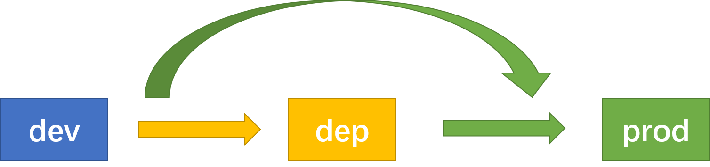
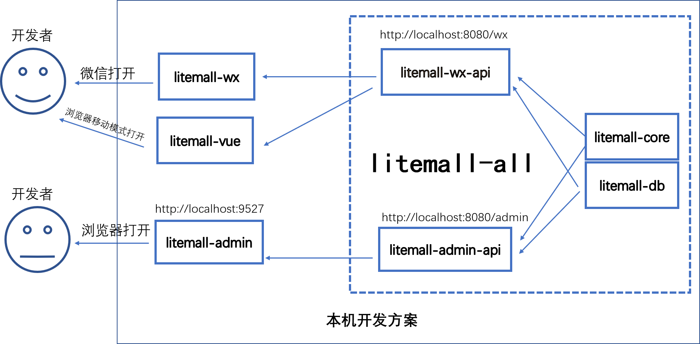
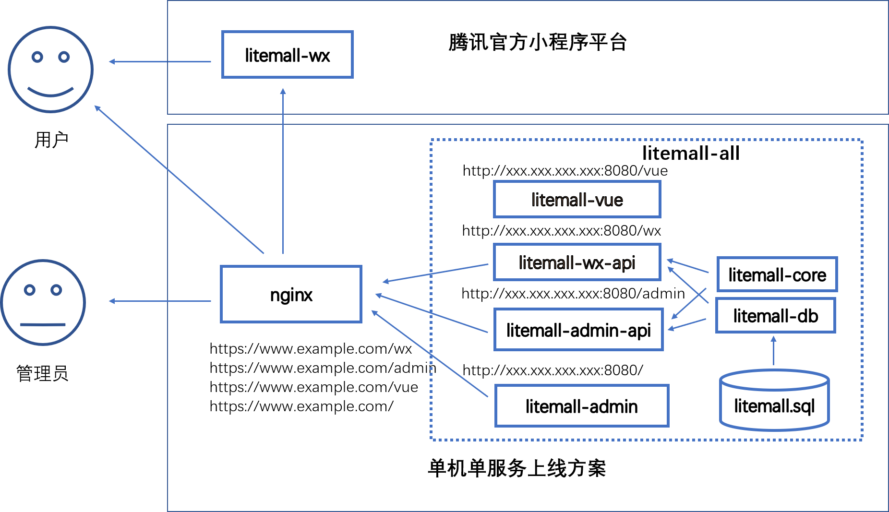

# 1 litemall系统

## 1.1 简介

litemall是一个简单的商场系统，基于现有的开源项目，重新实现一个完整的前后端项目，包含小程序客户端和网页管理端。

    


项目的架构是三个系统和六个模块：

* 基础系统子系统(platform)

  由数据库、litemall-core模块、litemall-db模块和litemall-all模块组成;

* 小商场子系统(wxmall)

  由litemall-wx-api模块和litemall-wx模块组成；

* 后台管理子系统(admin)

  由litemall-admin-api模块和litemall-admin模块组成。

* 简单商城系统(mall)

  这里仅列出，目前没有开发计划。

而六个模块的开发设计到三种技术栈：

* Spring Boot技术栈

  采用IDEA开发工具，开发litemall-core、litemall-db、litemall-admin-api、
  litemall-wx-api和litemall-all共五个模块；
  
* miniprogram（微信小程序）技术栈

  采用微信小程序开发工具，开发litemall-wx模块；
  
* Vue技术栈

  采用VSC开发工具，开发litemall-admin模块。

## 1.2 系统功能

从业务功能上，目前由五个业务模块组成：

* 会员业务模块
* 商场业务模块
* 商品业务模块
* 推广业务模块
* 系统业务模块

### 1.2.1 小程序端功能

* 首页
* 专题列表、专题详情
* 分类列表、分类详情
* 品牌列表、品牌详情
* 新品首发、人气推荐
* 搜索
* 商品详情
* 商品评价列表、商品评价
* 购物车
* 下单
* 个人
* 订单列表、订单详情
* 地址列表、地址添加、地址删除
* 收藏、足迹

### 1.2.2 管理平台功能

* 会员管理
  * 会员管理
  * 收货地址
  * 会员收藏
  * 会员足迹
  * 搜索历史
* 商城管理
  * 行政区域
  * 品牌制造商
  * 订单管理
  * 商品类目
  * 通用问题
  * 关键词
  * 渠道管理（待定）
* 商品管理
  * 商品列表
  * 商品上架
  * 商品编辑
  * 用户评论
* 推广管理
  * 广告管理
  * 专题管理
* 系统管理
  * 管理员
  * 对象存储
  * 权限管理（待定）
  * 定时任务（待定）
  * 参数管理（待定）
  * 系统日志（待定）
* 统计管理
  * 用户统计
  * 订单统计
  * 商品统计

## 1.3 项目特点

存在以下特点：

* 数据库方面，只是简单的表，表和表之间的依赖关系没有采用外键设计，而是依赖Java代码在service层面或者业务层面保证。这样做的好处是数据库频繁改动很方便，不会因为外键而导致数据库难以修改;
* 涉及三种技术栈，但是每种技术栈仅涉及最基础的技术；
  * 后端技术栈，仅涉及 Spring，Spring Boot, Spring MVC和Mybatis技术，其他后端技术暂时不采用;
  * 小程序技术栈，仅涉及miniprogram官方文档；
  * 前端技术栈，仅涉及vue, vuex, vue-route和element技术；
* 安全方面，仅采用最基本的代码，提供简单基本的安全服务;
* 性能方面，没有涉及内存数据库缓存功能，而是完全依赖MySQL;
* 对象存储服务方面，支持本地存储和第三方云存储方案。
* 消息通知方面，支持邮件通知、第三方云短信通知和微信模板通知；
* 部署方便，支持多服务部署和一键部署脚本；
* 文档全面，虽然还在开发中，但是规划中文档和代码注释一定会完成，帮助开发者理解项目。

总之，目前的系统只是为了学习技术和业务而开发的一个简单商场原型系统。虽然缺失很多企业级功能，但是是完整和合理的原型系统。

注意：
> 以上特点并不一定是优点。

接下来，从项目的开发、部署（测试）和上线三个阶段介绍litemall。



首先需要明确的是三个不同阶段：

* dev

即develop或者development, 这里指开发阶段，通常代码是直接在本地编译、运行和测试。
此外，这里服务访问地址通常是localhost。这里的“用户”主要是指开发者本身。

* dep

即deploy或者deployment，这里指部署（测试阶段），通常代码已经编译打包运行在远程主机中，
可以对外服务。此外，这里服务访问地址通常是IP地址。如果IP是公网IP，那么
部署以后就可以对外服务；如果是内网地址，那么只能内网访问。这里的“用户”主要是
指开发者本身、测试者；当然，如果是局域网或者不介意IP访问的，那么这里的“用户”
也可能是最终使用者用户。

* prod

即product或者production，这里指上线阶段，通常也是代码编译打包运行在远处主机中可以对外服务。
此外，这里服务访问地址通常是域名地址，同时端口是80web端口。上线以后直接面向的是最终用户。
虽然服务的代码本身和dep是完全一样的，但是考虑到场景的不同，上线阶段可能在运行环境方面需要做
调整，例如采用反向代理屏蔽内部实际项目结构。此外，最大的不同应该是上线环境下要使用域名和80端口，
而部署阶段则更为自由。

其次，需要明确的是，这里划分三种阶段不是简单的文档说明，还直接影响项目本身的行为
和代码编译结果，因此开发者需要清晰的了解：

最后，其实dep和prod不存在先后关系。例如，如果开发者已经存在域名和生产环境，可以直接
跳过dep阶段，而直接部署在线上环境中。因此有些时候，这里部署和上线是一个阶段。

当然，这里仍然建议先dep后prod，是因为对于第一次开发而言，先dep阶段可以避免对域名、https证书等非业务相关工作的干扰。

此外，有些业务功能（例如微信支付）必须是域名访问，那么开发和部署阶段可以先采用模拟或跳过的形式，
先不开发和测试这样业务功能，等其他功能开发完毕和部署测试成功以后，再来开发这些线上环境才能
运行的功能，此时会有一个好的基础。

## 1.4 开发方案



如图所示，当前开发阶段的方案：

* MySQL数据访问地址`jdbc:mysql://localhost:3306/litemall`
* litemall-wx-api后台服务地址`http://localhost:8080/wx`，数据则来自MySQL
* litemall-admin-api后台服务地址`http://localhost:8080/admin`,数据则来自MySQL
* litemall-admin前端访问地址`http://localhost:9527`, 数据来自litemall-admin-api
* litemall-wx没有前端访问地址，而是直接在微信小程序工具上编译测试开发，最终会部署到微信官方平台（即不需要自己部署web服务器），而数据则来自litemall-wx-api


### 1.4.1 数据库

数据库环境设置过程如下：

1. 安装MySQL

2. 创建数据库、用户权限、数据库表和测试数据

   数据库文件存放在litemall-db/sql文件夹中，其中litemall_schema.sql创建数据库和用户权限，
   litemall_table.sql则创建表，litemall_data.sql则是测试数据。

   注意：建议采用命令行或者MySQL Workbench。如果采用navicat可能导入失败。

### 1.4.2 Spring Boot开发环境

1. 安装JDK8
2. 安装Maven
3. 安装Git（可选）
4. 安装IDEA Community，建议安装Maven插件和git插件。Eclipse没有试过，但是应该也是可行的。
5. IDEA导入本项目
6. 采用Maven命令安装依赖库

   例如：
   ```
   cd litemall
   mvn install
   ```
   
   或者采用IDEA的Maven插件安装本项目依赖库，点击`install`

    

7. 采用Maven命令编译本项目

   例如：
   ```
   cd litemall
   mvn compile
   ```

   此时可以看到，litemall-wx-api等模块多了target文件夹，里面是编译出的文件。
   
   或者采用IDEA的Maven插件编译本项目，点击`compile`
   
   如果采用IDEA也可以跳过当前步骤，直接步骤8（因为运行时会自动编译再运行）。
   
8. 采用Maven命令运行本项目的litemall-all

   例如：
   ```
   cd litemall/litemall-all
   mvn spring-boot:run
   ```
   
   如果采用IDEA，则litemall-all模块的Application类
   右键` Run Application.main()`方式运行该模块,
   
   
   
   打开浏览器，输入
    ```
    http://localhost:8080/wx/index/index
    http://localhost:8080/admin/index/index
    ```
    如果出现JSON数据，则litemall-all模块运行正常。
    
注意：
> 1. 在上述开发步骤中，既介绍了Maven命令方式，也介绍了IDEA方式，但是仍然建议
>    开发时采用IDEA即可。
> 2. 以上是本人开发过程中采用的一些步骤，开发者可不拘泥于这些步骤。
> 3. 开发者使用IDEA导入项目或者运行项目的时候会出现软件卡顿的现象，这通常是litemall-admin的
>    node_modules文件夹内自动下载了大量的litemall-admin的依赖库，当IDEA尝试索引该文件夹内的大量文件时
>    则出现IDEA卡顿的现象，具体解决方式可以参见[FAQ](./FAQ.md)

### 1.4.3 微信小程序开发环境

1. 安装微信小程序开发工具
2. 导入本项目的litemall-wx模块文件夹
3. 编译前，请确定litemall-all模块已经运行，而litemall-wx模块的config文件夹中的api.js已经设置正确的后台数据服务地址；
4. 点击`编译`，如果出现数据和图片，则运行正常

注意：
> 1. 开发者编译以后，可以看到图片和数据，但是采用微信登录是肯定会失败的。
>    原因是这里的appid是本人申请的，而开发者不是本人app的开发者或体验者，
>    因此微信登录导致后台服务向微信服务器交互时会失败。
> 2. 有的开发者可能认为把litemall-wx模块的appid设置成开发者自己的appid就可以，
>    但是由于小商场的云主机后台服务的appid仍然是本人appid，因此微信登录时仍然会失败。
> 3. 开发者可以在litemall-wx和litemall-core模块中设置自己的appid，以及部署自己的后台服务，
>    相关内容请阅读章节3。或者，开发者可以采用账号登录方式登录，然后体验商品购买下单的方式。
> 4. 由于没有设置商户支付信息，因此开发者在付款时会失败。相关内容阅读章节3。

### 1.4.4 Vue开发环境

1. 安装[nodejs](https://nodejs.org/en/)
2. 安装依赖库
    
    ```
    cd litemall/litemall-admin
    npm install -g cnpm --registry=https://registry.npm.taobao.org
    cnpm install
    ```
    
3. 编译并运行
    
    ```
    cnpm run dev
    ```
    然后，打开浏览器，输入`http://localhost:9527`。
    如果出现管理后台登录页面，则表明管理后台的前端运行正常；
    
4. 请确定litemall-all模块已经运行，然后点击`登录`，如果能够成功登录，则表明管理后台的前端和后端对接成功，运行正常。

目前本人采用VSC（Visual Studio Code）来开发litemall-admin项目，开发者也可以采用其他熟悉的IDE。

## 1.5 部署方案
 
在1.4节中介绍的是开发阶段时一些关键性开发流程。本节将介绍代码开发成功以后开始部署项目时一些关键性流程。

首先，需要明确的是开发时项目使用的服务地址是本地地址，即localhost；而部署时则应该根据具体情况设置合理的服务器地址和端口。

其次，需要明确的是各模块之间的关系：
  
  * litemall-wx-api模块会包含litemall-core模块和litemall-db模块，部署在服务器中
  * litemall-admin-api模块会包含litemall-core模块和litemall-db模块，部署在服务器中
  * litemall-all模块则会包装litemall-wx-api模块和litemall-admin-api模块；
  * litemall-wx模块部署在微信开发者工具中，此外数据API地址指向litemall-wx-api所在服务qi地址
  * litemall-admin编译出的静态文件放在web服务器或者tomcat服务器，此外服务器地址设置指向3中litemall-admin-api所在地址
  
最后，**如果项目部署云主机，则根据开发者的部署环境在以下文件中或代码中修改相应的配置。**

1. MySQL数据库设置合适的用户名和密码信息；
2. 后台服务模块设置合适的配置信息；
3. 小商场前端litemall-wx模块`config/api.js`的`WxApiRoot`设置小商场后台服务的服务地址；
4. 管理后台前端litemall-admin模块`config/dep.env.js`中的`BASE_API`设置管理后台后台服务的服务地址。

实际上，最终的部署方案是灵活的：

* 可以是同一云主机中安装一个Spring Boot服务，同时提供litemall-admin、litemall-admin-api和litemall-wx-api三种服务
* 可以单一云主机中仅安装一个tomcat/nginx服务器部署litemall-admin静态页面分发服务，
  然后部署两个Spring Boot的后台服务；
* 也可以把litemall-admin静态页面托管第三方cdn，然后开发者部署两个后台服务
* 当然，甚至多个服务器，采用集群式并发提供服务。

注意
> 1. `本机`指的是是当前的开发机
> 2. `云主机`指的是开发者购买并部署的远程主机

以下简单列举几种方案。

### 1.5.1 单机单服务部署方案

本节介绍基于腾讯云的单机单服务部署方案，面向的是服务器数据和应用部署在云主机单机中用于演示的场景。
其他云应该也是可行的。

主要流程是：创建云主机，安装ubuntu操作系统，按照JDK和MySQL应用运行环境，部署单一Spring Boot服务。


#### 1.5.1.1 主机

请参考腾讯云官方文档进行相关操作。

1. 创建云主机虚拟机

2. 安装操作系统

   本项目采用ubuntu 16.04.1，但是并不限制其他操作系统。

3. 创建安全组

    

    目前允许的端口：8081，8082，8083，8080，80，443，22，3306
    
    注意：
    这里其实只需要8080端口，允许其他端口只是方面开发阶段的测试和调试。
    
4. 设置SSH密钥（可选）

    建议开发者设置SSH密钥，可以免密码登录云主机，以及用于脚本自动上传应用。

5. 使用PuTTY远程登录云主机

    如果开发者设置SSH密钥，可以采用免密码登录；否则采用账号和密码登录。
    
#### 1.5.1.2 JDK8

https://www.digitalocean.com/community/tutorials/how-to-install-java-with-apt-get-on-ubuntu-16-04

http://www.webupd8.org/2012/09/install-oracle-java-8-in-ubuntu-via-ppa.html

```bash
sudo add-apt-repository ppa:webupd8team/java
sudo apt-get update
sudo apt-get install oracle-java8-installer
sudo apt-get install oracle-java8-set-default
```

警告
> "ppa:webupd8team/java" 不是Oracle官方PPA，可能存在安全隐患。

#### 1.5.1.3 MySQL

https://www.digitalocean.com/community/tutorials/how-to-install-mysql-on-ubuntu-16-04

```
sudo apt-get update
sudo apt-get install mysql-server
sudo apt-get install mysql-client
```
    
### 1.5.1.4 项目打包

1. 在主机或者开发机打包项目到deploy；
    ```
    cd litemall
    cat ./litemall-db/sql/litemall_schema.sql > ./deploy/db/litemall.sql
    cat ./litemall-db/sql/litemall_table.sql >> ./deploy/db/litemall.sql
    cat ./litemall-db/sql/litemall_data.sql >> ./deploy/db/litemall.sql
    
    cd ./litemall-admin
    cnpm install
    cnpm run build:dep
    
    cd ..
    mvn clean package
    cp -f ./litemall-all/target/litemall-all-*-exec.jar ./deploy/litemall/litemall.jar
    ```
    这里的工作是：
    1. 把数据库文件拷贝到deploy/db文件夹
    2. 编译litemall-admin项目
    3. 编译litemall-all模块，同时把litemall-admin编译得到的静态文件拷贝到
       litemall-all模块的static目录
       
2. 修改litemall文件夹下面的*.yml外部配置文件，当litemall-all模块启动时会
    加载外部配置文件，而覆盖默认jar包内部的配置文件。
    例如，配置文件中一些地方需要设置成远程主机的IP地址
    
此时deploy部署包结构如下：

* bin
存放远程主机运行的脚本，包括deploy.sh脚本和reset.sh脚本

* db
存放litemall数据库文件

* litemall
存放远程主机运行的代码，包括litemall-all二进制可执行包和litemall外部配置文件

* util
存放开发主机运行的脚本，包括package.sh脚本和lazy.sh脚本。
由于是本地开发主机运行，因此开发者可以不用上传到远程主机。

### 1.5.1.5 项目部署

1. 远程主机环境（MySQL和JDK1.8）已经安装好，请确保云主机的安全组已经允许相应的端口。
2. 导入db/litemall.sql
    ```bash
    cd /home/ubuntu/deploy/db
    mysql -h localhost -u $ROOT -p$PASSWORD < litemall.sql
    ```
3. 启动服务
    ```bash
    sudo service litemall stop
    sudo ln -f -s /home/ubuntu/deploy/litemall/litemall.jar /etc/init.d/litemall
    sudo service litemall start
    ```
4. 测试是否部署成功(xxx.xxx.xxx.xxx是云主机IP）：
    ```
    http://xxx.xxx.xxx.xxx:8080/wx/index/index
    http://xxx.xxx.xxx.xxx:8080/admin/index/index
    http://xxx.xxx.xxx.xxx:8080/#/login
    ```

### 1.5.1.6 项目辅助脚本

在前面的项目打包和项目部署中都是采用手动命令来部署。
这里可以写一些脚本简化：

* util/packet.sh

在开发主机运行可以自动项目打包

* util/lazy.sh

在开发主机运行可以自动项目打包、项目上传远程主机、自动登录系统执行项目部署脚本。
    
注意：
> 1. 开发者需要在util/lazy.sh中设置相应的远程主机登录账号和密钥文件路径。
> 2. 开发者需要在bin/reset.sh设置远程主机的MySQL的root登录账户。
    
* bin/deploy.sh

在远程主机运行可以自动部署服务

* bin/reset.sh

在远程主机运行可以自动项目导入数据、删除本地上传图片、再执行bin/deploy.sh部署服务。

注意：
> 开发者需要在bin/reset.sh设置远程主机的MySQL的root登录账户。

总结，当开发者设置好配置信息以后，可以在本地运行lazy.sh脚本自动一键部署:
```bash
cd litemall
./deploy/util/lazy.sh
```

不过由于需要设置的信息会包含敏感安全信息，强烈建议开发者参考这里的deploy文件夹，
然后实现自己的deploy文件夹，妥善处置外部配置文件和脚本中的敏感安全信息!!!

### 1.5.2 单机多服务部署方案


### 1.5.2 集群式云部署方案

由于本项目是面向微小型企业的小商城系统，因此预期的分布式部署方案是

1. 专门的云数据库部署数据
2. 专门的云存储方案
3. 专门的CDN分发管理后台的静态文件
4. 一台云主机部署管理后台的后台服务
5. 一台或多台云主机部署小商场的后台服务

虽然由于环境原因没有正式测试过，但是这种简单的集群式场景应该是可行的。
在1.5.2节中所演示的三个服务是独立的，因此延伸到这里分布式是非常容易的。

但是，如果需要实现互联网式分布式云部署，目前的项目架构和方案不支持。
至少每个功能模块应该是独立服务系统。此外，需要引入单点登录系统、集群、缓存
和消息队列等多种技术。因此如果开发者需要这种形式的分布式方案，请参考其他项目。

## 1.6 上线方案

在1.5节部署方案中，我们介绍了多种部署的方案，但是实际上这些方案都不能立即用于正式环境：

1. 正式环境需要域名和HTTPS证书
2. 小商场的小程序端对服务器域名存在接入要求。

本节采用`www.example.com`域名作为示例。

注意
> `www.example.com`仅作为实例，不是真实环境下的域名。

这里列举一种基于1.5.2的单机多服务上线方案，即：
* 一个litemall-admin-api服务，独立提供管理后台前端的后台数据；
* 一个litemall-wx-api服务，独立提供小商城前端的后台数据；
* 一个nginx，对外出来litemall-admin的静态文件。




开发者可以基于自身业务采用其他上线方案。

### 1.6.1 域名

1. 注册域名，通常商业性的网站采用`.com`
2. 解析域名到服务器公网IP，采用`ping`命令查看是否解析成功
3. 备案

### 1.6.2 nginx

https://www.digitalocean.com/community/tutorials/how-to-install-nginx-on-ubuntu-16-04

在部署方案中建议安装了tomcat来访问管理后台，而这里上线方案中则建议使用nginx，
此时我们可以卸载tomcat（当然不卸载也可以，即同时支持8080端口访问）。

#### 1.6.2.1 nginx安装

采用命令
```bash
sudo apt-get update
sudo apt-get install nginx
```

有的文档会指出需要防火墙设置，但是腾讯云主机防火墙默认没有开启。
开发者这里自己可以开启设置，或者直接不开启。

打开浏览器，输入以下地址：
```
http://www.example.com
```

此时，如果看到nginx的欢迎页面，则安装成功。

安装以后：
* `/var/www/html`：默认静态web文件目录
* `/etc/nginx`:
* `/etc/nginx/nginx.conf`:
* `/etc/nginx/sites-avaiable`:
* `/etc/nginx/sites-enabled`:
* `/etc/nginx/snippets`:
* `/var/log/nginx/access.log`:
* `/var/log/nginx/error.log`:

#### 1.6.2.2 https

1. 申请证书
   
   可以参考[腾讯云 域名型证书申请流程](https://cloud.tencent.com/document/product/400/6814)

2. 下载证书

   这里使用nginx文件夹下面的密钥文件，例如`1_www.example.com_bundle.crt`和`2_www.example.com.key`

3. 部署证书到nginx

   可以参考[腾讯云 证书安装指引](https://cloud.tencent.com/document/product/400/4143)
   把两个密钥文件保存的`/etc/nginx`文件夹，然后修改`/etc/nginx/nginx.conf`文件：
   ```
	  server {
		listen 443;
		server_name www.example.com;
		ssl on;
		ssl_certificate /etc/nginx/1_www.example.com_bundle.crt;
		ssl_certificate_key /etc/nginx/2_www.example.com.key;
		ssl_session_timeout 5m;
		ssl_protocols TLSv1 TLSv1.1 TLSv1.2;
		ssl_ciphers ECDHE-RSA-AES128-GCM-SHA256:HIGH:!aNULL:!MD5:!RC4:!DHE;
		ssl_prefer_server_ciphers on;
      }
   ```
   
4. 重启nginx

打开浏览器，输入以下地址：
```
https://www.example.com
```

此时，可以看到https协议的nginx欢迎页面。

#### 1.6.2.3 litemall-admin静态文件

修改`/etc/nginx/nginx.conf`文件，配置nginx静态web文件目录
```
server {
    location / {
	    root /home/ubuntu/deploy/litemall-admin/dist;
		index index.html index.htm;
	}
}
```

打开浏览器，输入以下地址：
```
https://www.example.com
```

此时，可以看到管理后台的页面。

#### 1.6.2.3 反向代理两个个后台服务

继续修改`/etc/nginx/nginx.conf`文件，配置nginx静态web文件目录
```
server {
	location ^~ /wx {
        proxy_pass  http://localhost:8082;
        proxy_set_header    Host    $host;
        proxy_set_header    X-Real-IP   $remote_addr;
        proxy_set_header    X-Forwarded-For $proxy_add_x_forwarded_for;
    }

    location ^~ /admin {
        proxy_pass  http://localhost:8083;
        proxy_set_header    Host    $host;
        proxy_set_header    X-Real-IP   $remote_addr;
        proxy_set_header    X-Forwarded-For $proxy_add_x_forwarded_for;
    }
}
```

打开浏览器，输入以下地址：
```
https://www.example.com/wx/index/index
https://www.example.com/admin/index/index
```

此时，看到后台数据说明反向代理配置成功。

#### 1.6.2.4 全站加密

服务器自动把http的请求重定向到https

```
server {
    listen 80;
    server_name www.example.com;
    rewrite https://$server_name$request_uri? permanent;
}
```

打开浏览器，输入以下地址：
```
http://www.example.com
```

总结，经过以上不同方面的配置，nginx这里最终的配置是如下：
1. 证书`1_www.example.com_bundle.crt`和`2_www.example.com.key`放置在
    `/etc/nginx/`文件夹内。
2. 把`/etc/nginx/nginx.conf`文件进行修改，具体可以参考[本项目的nginx.conf](./pic/nginx.conf)
3. 重启nginx

注意：
> 本人对nginx也不了解，仅仅依靠网络知识配置了简单的效果。
> 更多配置方法和功能，请开发者自行学习。

### 1.6.3 小程序端上线

这里参考小程序官方文档，上线自己的小商城。

上线之前需要修改代码或者配置文件：
1. litemall-wx-api模块的WxOrderController类的payNotify方法的链接换成合适的地址。

   注意：
   > 换成什么地址都可以，但是这里不应该暴露出来。也就是说这个地址是微信支付平台
   > 和这里的小商场后台服务之间的交互API，对外公开会存在安全隐患。
   
2. litemall-core模块需要配置application-core.yml

    ```
    litemall:
        wx:
            app-id: wxa5b486c6b918ecfb
            app-secret: e04004829d4c383b4db7769d88dfbca1
            mch-id: 111111
            mch-key: xxxxxx
            notify-url: http://www.example.com/wx/order/pay-notify
    ```
    
    这里的`litemall.wx.notify-url`就是前面开发者自定义的地址。
    
3. litemall-wx模块的`project.config.json`文件调整相应的值，
   特别是`appid`要设置成开发者申请的appid。

### 1.6.4 管理后台服务上线

管理后台服务上线，则开发者需要自己的线上环境在以下文件中或代码中修改相应的配置。

1. MySQL数据库设置合适的用户名和密码信息；
2. 后台服务模块设置合适的配置信息，建议开发者参考deploy/litemall的外部配置文件，
   这样可以避免开发者对模块内部的开发配置文件造成修改；
3. 小商场前端litemall-wx模块`config/api.js`的`WxApiRoot`设置小商场后台服务的服务地址；
4. 管理后台前端litemall-admin模块`config/prod.env.js`中的`BASE_API`设置管理后台后台服务的服务地址。


### 1.6.5 上线脚本

本项目目前没有上线脚本，不过可以参考1.5.1节中的部署脚本。

### 1.6.6 项目优化

以下是部署方案中出现而在上线方案中可以优化的一些步骤。

#### 1.6.6.1 卸载tomcat

如果部署方案中采用tomcat而8080端口访问后台，而这里配置nginx后，
可以直接采用80端口访问，因此tomcat可以卸载。

#### 1.6.6.2 管理后台前端文件启动优化

litemall-admin编译得到的前端文件在第一次加载时相当耗时，这里需要一些措施来优化启动速度

* 静态文件托管CDN

  在上节中，建议采用卸载tomcat，采用nginx托管管理后台的静态文件。
  这里可以进一步地，把静态文件托管到CDN，当然这里是需要收费。

* gzip压缩

* 动态加载

#### 1.6.6.3 后台服务内部访问

原来后台服务可以通过域名或者IP直接对外服务，而这里采用nginx反向代理后可以
通过80端口访问后台服务。因此，会存在这样一种结果：
* 用户可以https协议的80端口访问后台服务（nginx反向代理）
* 用户也可以通过http协议的8081、8082、8083访问后台服务（spring boot）
由于http不是安全的，这里可能存在安全隐患

而如果取消后台服务的对外访问，这样可以保证用户只能采用安全的https协议访问后台服务。
同时，对外也能屏蔽内部具体技术架构细节。

#### 1.6.6.4 nginx优化

本人对nginx不是很熟悉，而nginx还存在很多可以调整优化的部分，这里建议开发者
根据自己业务或架构情况优化。

## 1.7 项目管理

这里简述一些当前项目开发的要点。

### 1.7.1 项目.gitignore

当前项目的.gitignore不是单一文件，而是多个模块都存在：
* deploy/.gitignore
* litemall-admin/.gitignore
* litemall-admin-api/.gitignore
* litemall-core/.gitignore
* litemall-db/.gitignore
* litemall-wx-api/.gitignore
* litemall-all/.gitignore
* .gitignore

### 1.7.2 项目自动部署

#### 1.7.2.1 deploy部署

当前项目存在deploy部署文件夹，这个是上述1.5.1节部署腾讯云主机所采取的一些脚本。

流程如下：
1. util脚本是当前开发主机运行，用来打包项目和上传腾讯云主机；
2. 打包项目时，会编译打包项目相关模块到litemall和db文件夹中；
3. bin脚本是云主机运行，用来安装数据库、导入数据、启动项目服务。

这里deploy部署方式比较简单不灵活，开发者可以参考开发自己的项目脚本。

#### 1.7.2.2 .gitlab-ci.yml部署

如果项目源代码托管在gitlab中，可以采用这个配置文件自动部署。

#### 1.7.2.3 docker部署

目前未支持

### 1.7.3 Spring Boot配置方案

当前两个后台服务是采用Spring Boot开发，但是在参数配置方面可能需要这里说明一下，
帮助开发者更好地理解这里作为多模块Spring Boot的配置方式。

#### 1.7.3.1 profile

#### 1.7.3.2 stage

### 1.7.4 项目配置

这里列出一些项目相关的基本配置信息：